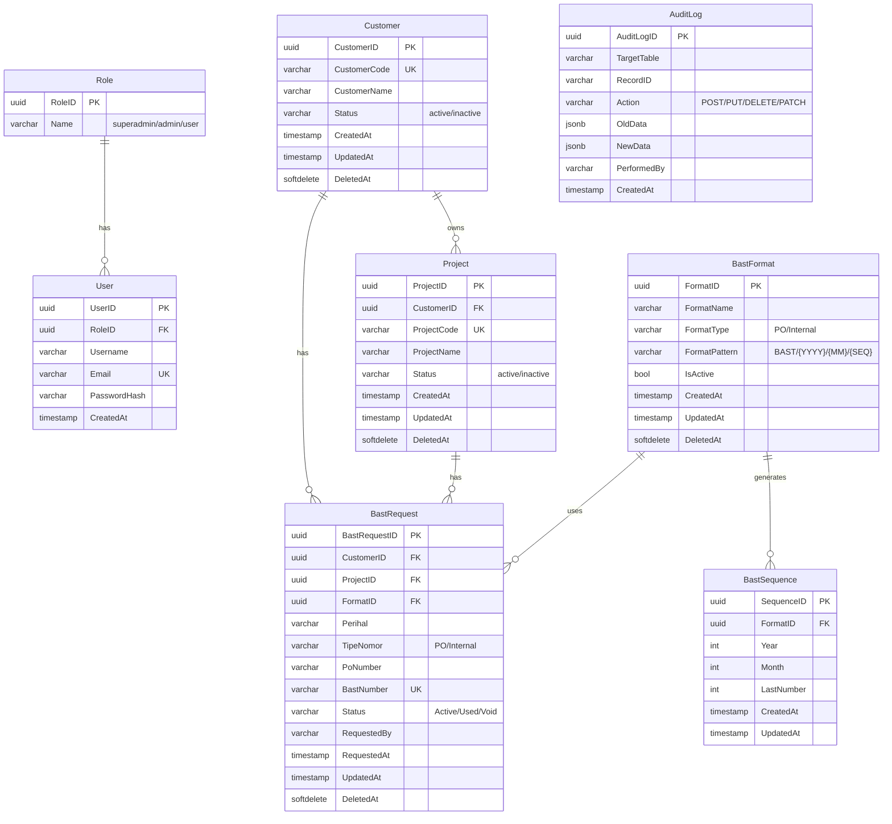
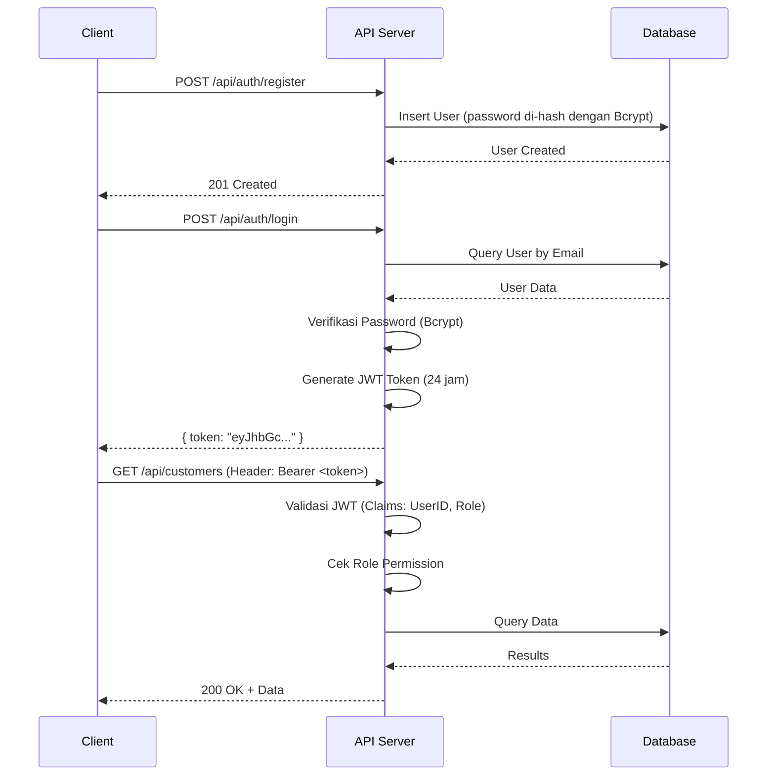
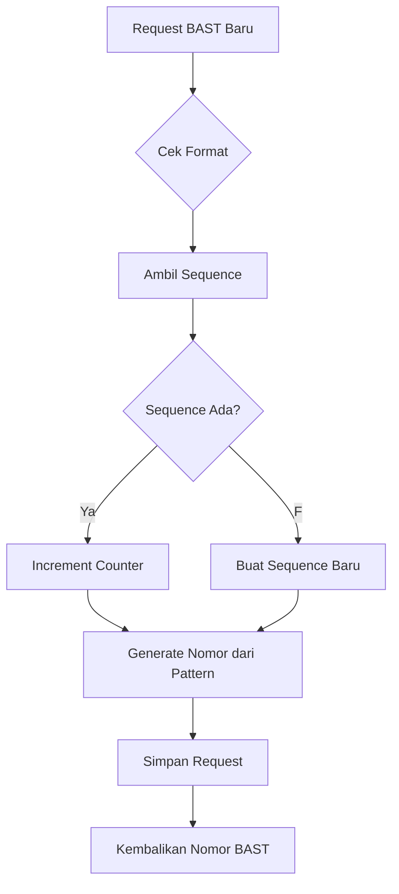

# BAST Request API

Sistem API berbasis **Golang** untuk mengelola pembuatan dan permintaan **Berita Acara Serah Terima (BAST)** secara otomatis. Aplikasi ini dikembangkan dengan **Clean Architecture**, menjamin pemisahan tugas yang jelas (*Separation of Concerns*), skalabilitas, dan kemudahan pengujian.

---

## 🌟 Fitur Utama

- **Penomoran Otomatis yang Aman (*Atomic Sequence*):** Pembuatan nomor BAST secara berurutan dan kebal dari bentrok (Race Condition) berkat *Database Transactions*.
- **Role-Based Access Control (RBAC):** Sistem *Login* & Registrasi menggunakan **JWT (JSON Web Tokens)** dengan pengamanan hak akses level pengguna (*Superadmin, Admin, User*).
- **Master Data Terpusat:** Manajemen CRUD untuk `Customer`, `Project`, dan `Format Penomoran BAST`.
- **Audit Trail Log:** Semua aktivitas dan perubahan krusial di dalam sistem tercatat secara rapi dan otomatis ke dalam log database yang siap ditinjau kapanpun.
- **Auto-Generated Documentation:** Terintegrasi penuh dengan **Swagger UI** untuk memudahkan *frontend developer* membaca skema API.

---

## 🛠️ Teknologi yang Digunakan

| Kategori | Teknologi | Versi |
|----------|-----------|-------|
| **Bahasa Pemrograman** | [Go (Golang)](https://go.dev/) | 1.26+ |
| **Web Framework** | [Gin Gonic](https://gin-gonic.com/) | v1.12.0 |
| **ORM** | [GORM](https://gorm.io/) | v1.31.1 |
| **Database** | [SQLite](https://github.com/glebarez/sqlite) (Pure Go, tanpa CGO) | v1.11.0 |
| **Autentikasi** | [golang-jwt/jwt](https://github.com/golang-jwt/jwt) | v5.3.1 |
| **Password Hashing** | [golang.org/x/crypto/bcrypt](https://pkg.go.dev/golang.org/x/crypto/bcrypt) | v0.53.0 |
| **Dokumentasi API** | [Swaggo](https://github.com/swaggo/swag) | v1.16.6 |
| **UUID Generator** | [google/uuid](https://github.com/google/uuid) | v1.6.0 |

---

## 🏗️ Struktur Arsitektur (Clean Architecture)

Proyek ini disusun dengan batas *layer* yang sangat ketat:

```text
.
├── cmd/
│   └── api/main.go          # Pintu masuk (Entry point) aplikasi.
├── docs/                    # Dokumentasi (Swagger + Panduan & Tutorial).
├── internal/
│   ├── config/              # Konfigurasi Database (GORM, Migrasi, Seed).
│   │   ├── database.go      # Koneksi database & AutoMigrate.
│   │   └── seed.go          # Seeding data contoh (Roles, Customer, Project, Format).
│   ├── handlers/            # Layer Terluar: Menerima HTTP Request, Parsing JSON (Gin).
│   │   ├── audit_log_handler.go
│   │   ├── auth_handler.go
│   │   ├── bast_format_handler.go
│   │   ├── bast_request_handler.go
│   │   ├── bast_sequence_handler.go
│   │   ├── customer_handler.go
│   │   └── project_handler.go
│   ├── middlewares/         # Satpam API: Memverifikasi JWT dan Role Akses.
│   │   └── auth_middleware.go
│   ├── models/              # Struktur Database (Entity/GORM Struct).
│   │   ├── audit_log.go
│   │   ├── auth.go          # Request DTO (LoginRequest, RegisterRequest).
│   │   ├── bast_format.go
│   │   ├── bast_request.go
│   │   ├── bast_sequence.go
│   │   ├── customer.go
│   │   ├── project.go
│   │   ├── role.go
│   │   └── user.go
│   ├── repositories/        # Layer Terdalam: Akses kueri SQL Database murni.
│   │   ├── audit_log_repository.go
│   │   ├── auth_repository.go
│   │   ├── bast_format_repository.go
│   │   ├── bast_request_repository.go
│   │   ├── bast_sequence_repository.go
│   │   ├── customer_repository.go
│   │   ├── project_repository.go
│   │   └── user_repository.go
│   ├── routes/              # Routing & Dependency Injection setup.
│   │   └── routes.go
│   ├── services/            # Logika Bisnis Utama (Core Logic & Validation).
│   │   ├── audit_log_service.go
│   │   ├── auth_service.go
│   │   ├── bast_format_service.go
│   │   ├── bast_request_service.go
│   │   ├── bast_sequence_service.go
│   │   ├── customer_service.go
│   │   └── project_service.go
│   └── utils/               # Fungsi bantuan teknis (Hash, Token).
│       ├── hash.go
│       └── jwt.go
├── go.mod
├── go.sum
└── README.md
```

*Aturan Emas: Handler memanggil Service, Service memanggil Repository, Repository memanggil Database.*

---

## 📊 Skema Database

### ERD (Entity Relationship Diagram)



### Tabel Database

| Nama Tabel | Keterangan | Catatan Penting |
|------------|------------|-----------------|
| `Role` | Daftar role pengguna | Seed: superadmin, admin, user |
| `User` | Data pengguna系统 | Foreign Key ke Role |
| `master_customer` | Data pelanggan | Soft delete, unique code |
| `master_project` | Data proyek | FK ke Customer, soft delete |
| `master_bast_format` | Format penomoran BAST | Pattern: `BAST/{YYYY}/{MM}/{SEQ}` |
| `bast_sequence` | Running number BAST | Composite unique: FormatID + Year + Month |
| `bast_request` | Permintaan nomor BAST | Unique index pada BastNumber |
| `audit_log` | Log aktivitas sistem | Menyimpan OldData & NewData (JSON) |

---

## 🔐 Sistem Autentikasi & Otorisasi

### Alur Autentikasi



### Role & Hak Akses

| Role | Deskripsi | Hak Akses |
|------|-----------|-----------|
| `superadmin` | Admin sistem penuh | Semua endpoint + Kelola user + Reset sequence |
| `admin` | Admin departemen | CRUD Master Data + Buat request BAST |
| `user` | Pengguna biasa | Lihat data + Buat request BAST |

### Endpoint Public vs Protected

| Endpoint | Method | Akses | Keterangan |
|----------|--------|-------|------------|
| `/api/auth/register` | POST | Public | Registrasi akun baru |
| `/api/auth/login` | POST | Public | Login & dapatkan JWT |
| `/api/customers` | GET | Protected | Lihat semua customer |
| `/api/customers/:id` | GET | Protected | Lihat customer by ID |
| `/api/customers` | POST | Protected | Buat customer baru |
| `/api/customers/:id` | PUT | Protected | Update customer |
| `/api/customers/:id` | DELETE | Admin/Superadmin | Hapus customer |
| `/api/projects` | GET | Protected | Lihat semua project |
| `/api/projects/:id` | GET | Protected | Lihat project by ID |
| `/api/projects` | POST | Admin/Superadmin | Buat project baru |
| `/api/projects/:id` | PUT | Protected | Update project |
| `/api/projects/:id` | DELETE | Protected | Hapus project |
| `/api/bast-formats` | GET | Protected | Lihat semua format |
| `/api/bast-formats/:id` | GET | Protected | Lihat format by ID |
| `/api/bast-formats` | POST | Protected | Buat format baru |
| `/api/bast-formats/:id` | PUT | Protected | Update format |
| `/api/bast-formats/:id` | DELETE | Protected | Hapus format |
| `/api/bast-sequences` | GET | Protected | Lihat sequence aktif |
| `/api/bast-sequences/reset` | POST | Protected | Reset sequence |
| `/api/bast-requests` | GET | Protected | Lihat semua request |
| `/api/bast-requests/:id` | GET | Protected | Lihat request by ID |
| `/api/bast-requests` | POST | Protected | Buat request BAST baru |
| `/api/bast-requests/:id/status` | PATCH | Protected | Update status request |
| `/api/bast-requests/:id/audit` | GET | Protected | Lihat audit log request |
| `/api/audit-logs` | GET | Protected | Lihat semua audit log |
| `/api/audit-logs/:id` | GET | Protected | Lihat audit log by ID |

---

## 📝 Format Penomoran BAST

Sistem mendukung pola penomoran yang dapat dikonfigurasi:

### Contoh Pola

| Format | Pola | Contoh Hasil |
|--------|------|--------------|
| PO Standar | `BAST/PO/{YYYY}/{MM}/{SEQ}` | `BAST/PO/2026/06/001` |
| Internal | `BAST/INT/{YYYY}/{MM}/{SEQ}` | `BAST/INT/2026/06/001` |

### Variabel yang Didukung

| Variabel | Keterangan | Contoh |
|----------|------------|--------|
| `{YYYY}` | Tahun 4 digit | `2026` |
| `{MM}` | Bulan 2 digit | `06` |
| `{SEQ}` | Nomor urut (running number) | `001` |

### Alur Penomoran



---

## 🚀 Panduan Instalasi & Menjalankan Aplikasi

Aplikasi ini sudah dipaket dengan SQLite lokal dan sistem *Seeding* otomatis, sehingga Anda dapat langsung menjalankannya tanpa perlu menginstal database eksternal!

### 1. Prasyarat

Pastikan Anda sudah menginstal [Go](https://go.dev/dl/) versi `1.20` atau lebih tinggi di mesin Anda.

```bash
# Cek versi Go
go version
```

### 2. Kloning Repositori

```bash
git clone https://github.com/madajabbar/BAST-REQUEST.git
cd BAST-REQUEST
```

### 3. Unduh Dependensi

```bash
go mod tidy
```

### 4. Menjalankan Server

```bash
go run .\cmd\api\main.go
```

*Saat dijalankan pertama kali, aplikasi akan otomatis:*
1. *Membuat file `bast_request.db`*
2. *Membuat semua tabel (AutoMigrate)*
3. *Menyisipkan data contoh:*
   - *3 Role: superadmin, admin, user*
   - *2 Customer: PT. Maju Mundur, CV. Sukses Selalu*
   - *2 Project: Implementasi Sistem ERP Terpadu, Migrasi Infrastruktur Cloud*
   - *2 Format: Format PO Standar, Format Internal Perusahaan*

### 5. Verifikasi Server

```bash
# Test endpoint ping
curl http://localhost:8080/ping
# Response: {"message":"pong"}
```

---

## 📚 Menjelajahi Dokumentasi API (Swagger)

Aplikasi memiliki antarmuka grafis (UI) untuk Anda menguji coba seluruh *Endpoint* secara langsung.
Saat server menyala, buka *browser* Anda dan kunjungi:

👉 **http://localhost:8080/swagger/index.html**

### Cara Menggunakan Swagger

1. **Register** atau **Login** terlebih dahulu untuk mendapatkan token JWT
2. Klik tombol **Authorize** (ikon gembok) di pojok kanan atas
3. Masukkan token dengan format: `Bearer <token>`
4. Sekarang Anda dapat mengakses semua endpoint yang dilindungi

### Contoh Request

#### Register

```bash
curl -X POST http://localhost:8080/api/auth/register \
  -H "Content-Type: application/json" \
  -d '{
    "username": "john_doe",
    "email": "john@example.com",
    "password": "secret123",
    "role": "user"
  }'
```

#### Login

```bash
curl -X POST http://localhost:8080/api/auth/login \
  -H "Content-Type: application/json" \
  -d '{
    "email": "john@example.com",
    "password": "secret123"
  }'
```

#### Buat BAST Request

```bash
curl -X POST http://localhost:8080/api/bast-requests \
  -H "Content-Type: application/json" \
  -H "Authorization: Bearer <your-token>" \
  -d '{
    "customer_id": "uuid-customer",
    "project_id": "uuid-project",
    "format_id": "uuid-format",
    "perihal": "Serah Terima Fase 1",
    "tipe_nomor": "PO",
    "po_number": "PO-2026-001"
  }'
```

---

## 📖 Belajar & Panduan Lebih Dalam

Khusus untuk Anda yang ingin membedah kode ini atau baru belajar Golang, silakan buka **pusat dokumentasi** di folder [`docs/`](docs/README.md):

> 📂 **[`docs/README.md`](docs/README.md)** — Peta navigasi lengkap semua dokumen.

### Mulai dari sini (Pemula)

- 🚀 [**Gambaran Umum Aplikasi**](docs/getting-started/overview.md) — fitur, teknologi, alur kerja.
- 🚀 [**Panduan Instalasi**](docs/getting-started/installation.md) — setup, run, smoke test.

### Pahami Fondasi

- 🏗️ [**Clean Architecture**](docs/architecture/clean-architecture.md) — pola 4-layer + analogi restoran.
- 🗄️ [**Skema Database & ERD**](docs/architecture/database-schema-erd.md) — diagram Mermaid + penjelasan tabel.
- 🎓 [**Fondasi Golang**](docs/architecture/golang-fundamentals.md) — struct, pointer, error handling.

### Membedah Kode (Tutorial Step-by-Step)

1. [**Step 1: Setup & Konfigurasi**](docs/tutorials/step-01-setup-and-config.md)
2. [**Step 2: Models & Migrasi**](docs/tutorials/step-02-models-and-migration.md)
3. [**Step 3: Autentikasi JWT**](docs/tutorials/step-03-authentication-jwt.md)
4. [**Step 4: Master Data CRUD**](docs/tutorials/step-04-master-data-crud.md)
5. [**Step 5: Mesin Penomoran BAST**](docs/tutorials/step-05-bast-numbering-engine.md)
6. [**Step 6: Audit Log**](docs/tutorials/step-06-audit-log.md)
7. [**Step 7: Routing & RBAC**](docs/tutorials/step-07-routing-and-rbac.md)
8. [**Step 8: Dokumentasi Swagger**](docs/tutorials/step-08-swagger-documentation.md)

### Panduan Topik Spesifik

- 🔐 [**Autentikasi & RBAC End-to-End**](docs/guides/authentication-guide.md)
- 🤿 [**Deep Dive Penomoran BAST**](docs/guides/bast-numbering-deep-dive.md) — race condition, locking, reset.
- 🛠️ [**Menambahkan Fitur Baru**](docs/guides/add-new-feature-guide.md) — contoh modul Division.
- 📘 [**Panduan Swagger**](docs/guides/swagger-guide.md) — regenerasi & troubleshooting.

### Referensi API per Endpoint

- 🔌 [**Daftar Lengkap Endpoint**](docs/api-reference/README.md) — method, parameter, contoh request/response.

---

## 🧪 Testing

### Manual Testing

```bash
# Test endpoint ping
curl http://localhost:8080/ping

# Register user
curl -X POST http://localhost:8080/api/auth/register \
  -H "Content-Type: application/json" \
  -d '{"username":"test","email":"test@example.com","password":"test123","role":"user"}'

# Login
curl -X POST http://localhost:8080/api/auth/login \
  -H "Content-Type: application/json" \
  -d '{"email":"test@example.com","password":"test123"}'
```

### Swagger UI

Buka browser dan akses: http://localhost:8080/swagger/index.html

---

## 📁 File Penting

| File | Keterangan |
|------|------------|
| `cmd/api/main.go` | Entry point aplikasi |
| `internal/config/database.go` | Konfigurasi koneksi database |
| `internal/config/seed.go` | Seed data contoh |
| `internal/routes/routes.go` | Definisi semua endpoint API |
| `internal/middlewares/auth_middleware.go` | Middleware autentikasi JWT & RBAC |
| `internal/utils/jwt.go` | Fungsi generate & validasi JWT |
| `internal/utils/hash.go` | Fungsi hash password dengan Bcrypt |
| `go.mod` | Daftar dependensi Go |
| `bast_request.db` | File database SQLite (auto-generated) |

---

## 🔧 Troubleshooting

### Masalah Umum

| Masalah | Solusi |
|---------|--------|
| `go: module not found` | Jalankan `go mod tidy` |
| `port already in use` | Ubah port di `cmd/api/main.go` atau hentikan proses lain |
| `database locked` | Hapus file `bast_request.db` dan restart aplikasi |
| `migration failed` | Hapus `bast_request.db` dan jalankan ulang |

### Reset Database

```bash
# Hapus database lama
rm bast_request.db

# Jalankan ulang aplikasi (akan auto-migrate & seed)
go run .\cmd\api\main.go
```

---

## 📄 License

Proyek ini dikembangkan untuk kebutuhan internal dan pembelajaran.

---

*Dikembangkan untuk efisiensi dan pencatatan yang solid.*
