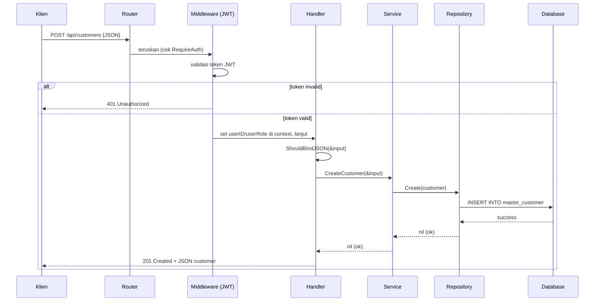

# Clean Architecture — BAST Request API

Dokumen ini menjelaskan filosofi arsitektur yang dipakai proyek ini: **mengapa** kode dipecah ke banyak folder, **bagaimana** tiap layer berkomunikasi, dan **apa untungnya** bagi Anda sebagai developer.

---

## 1. Mengapa Butuh Arsitektur?

Bayangkan Anda menulis seluruh logika aplikasi di satu file `main.go`: koneksi DB, query SQL, validasi bisnis, routing HTTP, dan respons JSON — semua bercampur. Saat aplikasi tumbuh, file itu jadi **monster 2000 baris** yang mustahil dirawat. Cari bug? Mimpi buruk. Ganti database? Harus bongkar seluruh kode.

**Clean Architecture** (atau *Layered Architecture*) menyelesaikan ini dengan satu prinsip sederhana: **pemisahan tanggung jawab** (*Separation of Concerns*). Tiap lapisan kode hanya boleh melakukan **satu jenis tugas**, dan tidak boleh mencampur aduk tugas layer lain.

---

## 2. Aturan Emas

> **Handler memanggil Service → Service memanggil Repository → Repository memanggil Database.**

Tidak boleh ada yang melompat. Handler **dilarang** menyentuh database langsung. Service **dilarang** tahu detail HTTP. Repository **dilarang** tahu aturan bisnis.

---

## 3. Analogi Restoran Cepat Saji

Agar mudah diingat, bayangkan aplikasi ini sebagai restoran:

| Layer Kode | Analogi Restoran | Tugasnya |
|---|---|---|
| **Handler** | 🧑‍🍳 **Kasir / Pelayan** | Menerima pesanan (Request) dari pelanggan, mengecek apakah format pesanan masuk akal, lalu meneruskan ke dapur. Kasir **tidak memasak**. |
| **Service** | 👨‍🍳 **Koki (Dapur)** | Memasak sesuai resep & aturan (logika bisnis, validasi, hitungan). Koki **tidak ke gudang** mengambil bahan sendiri — ia menyuruh asisten. |
| **Repository** | 📦 **Asisten Gudang** | Pergi ke gudang (Database), ambil bahan (Data SQL), atau simpan barang baru. Asisten **tidak tahu** masakan apa yang dibuat. |
| **Models** | 🥕 **Bahan Baku** | Bentuk fisik data yang diproses (wortel = `Customer`, daging = `Project`). Definisi struktur tabel database. |

Dengan analogi ini, mudah melihat **mengapa** pemisahan penting: jika restoran ganti supplier bahan (mis. pindah dari gudang A ke B), koki tetap masak dengan resep yang sama. Kode-nya pun begitu.

---

## 4. Struktur Folder & Tiap Layer

```text
BAST Request/
├── cmd/api/main.go              # Entry point: menghidupkan semua
├── internal/
│   ├── config/                  # Konfigurasi: koneksi DB, migrasi, seed
│   ├── models/                  # Layer 4 (Bahan Baku): Struct tabel DB
│   ├── repositories/            # Layer 3 (Asisten Gudang): Query SQL murni
│   ├── services/                # Layer 2 (Koki): Logika bisnis inti
│   ├── handlers/                # Layer 1 (Kasir): Penerima HTTP Request
│   ├── middlewares/             # Satpam: cek JWT & role di tengah jalan
│   ├── routes/                  # Penjahat routing URL & dependency injection
│   └── utils/                   # Fungsi bantu (hash password, JWT)
```

### A. Models (`internal/models/`)
Definisi `struct` Go yang merepresentasikan tabel database. Memakai **tag GORM** untuk menentukan tipe kolom, primary key, unique index, dll.

Contoh ([`internal/models/customer.go:10-18`](../../internal/models/customer.go)):
```go
type Customer struct {
    CustomerID   uuid.UUID      `gorm:"type:uuid;primary_key"`
    CustomerCode string         `gorm:"type:varchar(50);uniqueIndex;not null"`
    CustomerName string         `gorm:"type:varchar(255);not null"`
    Status       string         `gorm:"type:varchar(50);default:'active'"`
    CreatedAt    time.Time
    UpdatedAt    time.Time
    DeletedAt    gorm.DeletedAt `gorm:"index"`   // mengaktifkan soft delete
}
```

### B. Repositories (`internal/repositories/`)
**Satu-satunya layer** yang boleh berinteraksi langsung dengan database. Di sinilah semua sintaks GORM (`db.Create`, `db.Find`, `db.First`, `db.Save`) berada.

Contoh ([`internal/repositories/customer_repository.go:37-39`](../../internal/repositories/customer_repository.go)):
```go
func (r *CustomerRepository) Create(customer *models.Customer) error {
    return r.db.Create(customer).Error
}
```

### C. Services (`internal/services/`)
Tempat **logika bisnis**: validasi kustom, perhitungan (mis. penomoran BAST), orkestrasi antar repository. Service **tidak boleh** tahu tentang HTTP.

Contoh ([`internal/services/bast_request_service.go:34-73`](../../internal/services/bast_request_service.go)):
```go
func (s *BastRequestService) CreateRequest(req *models.BastRequest) error {
    // 1. Ambil format penomoran
    format, err := s.formatService.GetFormatByID(req.FormatID.String())
    if err != nil {
        return errors.New("invalid format ID")
    }
    // 2. Generate nomor BAST sesuai pola (lihat tutorial step-5)
    // 3. Simpan ke repository
    return s.repo.Create(req)
}
```

### D. Handlers (`internal/handlers/`)
Penerima **request HTTP**. Tugasnya: parse JSON/Query/Path param → panggil Service → bungkus hasilnya jadi respons JSON. Memakai **Gin Framework** penuh.

Contoh ([`internal/handlers/customer_handler.go:71-83`](../../internal/handlers/customer_handler.go)):
```go
func (h *CustomerHandler) CreateCustomer(c *gin.Context) {
    var input models.Customer
    if err := c.ShouldBindJSON(&input); err != nil {
        c.JSON(http.StatusBadRequest, gin.H{"error": err.Error()})
        return
    }
    if err := h.service.CreateCustomer(&input); err != nil {
        c.JSON(http.StatusInternalServerError, gin.H{"error": err.Error()})
        return
    }
    c.JSON(http.StatusCreated, input)
}
```

### E. Routes (`internal/routes/routes.go`)
Menyambungkan URL ke Handler yang tepat, sekaligus melakukan **Dependency Injection** (menyusun Repository → Service → Handler dari bawah ke atas).

### F. Middlewares (`internal/middlewares/`)
"Satpam" yang berdiri di tengah jalan request: cek token JWT valid (`RequireAuth`) dan cek role (`RequireRole`). Detail di [Tutorial Step 7](../tutorials/step-07-routing-and-rbac.md).

### G. Utils (`internal/utils/`)
Fungsi pembantu teknis: hashing password (`hash.go`) dan JWT (`jwt.go`).

---

## 5. Dependency Injection (DI)

Setiap layer menerima dependensinya **dari luar**, tidak membuat sendiri. Ini inti dari DI dan dilakukan di [`internal/routes/routes.go:19-45`](../../internal/routes/routes.go):

```go
// Susun dari bawah (Repository) ke atas (Handler)
customerRepo := repositories.NewCustomerRepository(db)              // butuh db
customerService := services.NewCustomerService(customerRepo)        // butuh repo
customerHandler := handlers.NewCustomerHandler(customerService)     // butuh service

// Hubungkan ke URL
api.POST("/customers", customerHandler.CreateCustomer)
```

**Kenapa begini?** Karena setiap layer menerima dependensi sebagai parameter konstruktor (`New...`), Anda bisa **mengganti** implementasinya saat testing (mis. mock repository tanpa database nyata).

---

## 6. Alur Lengkap Satu Request

Contoh: Klien membuat Customer baru via `POST /api/customers`.



---

## 7. Manfaat Nyata bagi Anda

| Manfaat | Penjelasan |
|---|---|
| 🔄 **Gampang ganti DB** | Mau pindah SQLite → PostgreSQL? Cukup ubah `config/database.go` & sedikit query di Repository. Handler & Service tak tersentuh. |
| 🧪 **Gampang diuji** | Service bisa diuji dengan Repository mock, tanpa DB nyata. |
| 🔍 **Gampang cari bug** | Error di query SQL? Lihat Repository. Error di validasi bisnis? Lihat Service. Error parsing JSON? Lihat Handler. |
| 🤝 **Gampang kolaborasi** | Tim bisa bekerja paralel: satu orang di Service, satu di Handler, tanpa konflik. |
| 🧩 **Gampang tambah fitur** | Pola berulang: buat 4 file (Model, Repo, Service, Handler) + daftarkan di Route. Lihat [Menambah Fitur Baru](../guides/add-new-feature-guide.md). |

---

## 8. Aturan yang Wajib Dijaga

❌ **Dilarang:**
- Memakai `gorm` di Handler atau Service (harus di Repository saja).
- Menulis logika bisnis (`if-else` kompleks) di Handler atau Repository.
- Memanggil HTTP-related (`gin.Context`) di Service atau Repository.

✅ **Boleh:**
- Handler memanggil banyak Service.
- Service memanggil banyak Repository (mis. `BastRequestService` memanggil `BastFormatService` + `BastSequenceService` — lihat [`internal/services/bast_request_service.go:12-24`](../../internal/services/bast_request_service.go)).

---

## 9. Bacaan Lanjutan

- 🗄️ Struktur data: [Skema Database & ERD](database-schema-erd.md)
- 🎓 Konsep Go: [Fondasi Golang](golang-fundamentals.md)
- 🛠️ Praktik nyata: [Tutorial Step 1](../tutorials/step-01-setup-and-config.md)
