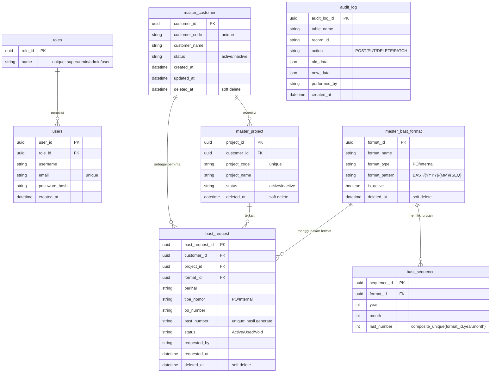

# Skema Database & ERD — BAST Request API

Dokumen ini memetakan seluruh struktur database aplikasi: tabel, kolom, tipe data, relasi, dan konsep penting seperti *soft delete* serta *unique index*. Semua tabel dibuat otomatis oleh **GORM AutoMigrate** ([`internal/config/database.go:26-42`](../../internal/config/database.go)).

---

## 1. Daftar Tabel

| Tabel (DB) | Model Go | File | Jenis |
|---|---|---|---|
| `roles` | `Role` | [`models/role.go`](../../internal/models/role.go) | Master Sistem |
| `users` | `User` | [`models/user.go`](../../internal/models/user.go) | Master Sistem |
| `master_customer` | `Customer` | [`models/customer.go`](../../internal/models/customer.go) | Master Data |
| `master_project` | `Project` | [`models/project.go`](../../internal/models/project.go) | Master Data |
| `master_bast_format` | `BastFormat` | [`models/bast_format.go`](../../internal/models/bast_format.go) | Master Data |
| `bast_sequence` | `BastSequence` | [`models/bast_sequence.go`](../../internal/models/bast_sequence.go) | Pendukung Transaksi |
| `bast_request` | `BastRequest` | [`models/bast_request.go`](../../internal/models/bast_request.go) | Transaksi Inti |
| `audit_log` | `AuditLog` | [`models/audit_log.go`](../../internal/models/audit_log.go) | Audit Trail |

> 📝 **Catatan:** Nama tabel ditentukan oleh method `TableName()` di tiap model (mis. `master_customer`), bukan otomatis jamak. Tanpa method itu, GORM akan mem-jamak-kan nama struct (mis. `customers`).

---

## 2. Entity-Relationship Diagram (ERD)



---

## 3. Penjelasan Tiap Tabel

### 🛡️ `roles` & `users` — Sistem Autentikasi
Dua tabel ini mengatur siapa boleh melakukan apa.

- **`roles`**: Daftar peran tetap (di-seed saat awal): `superadmin`, `admin`, `user`. Lihat [`internal/config/seed.go:16-26`](../../internal/config/seed.go).
- **`users`**: Akun pengguna. Password disimpan sebagai **hash bcrypt** (bukan teks biasa) di kolom `password_hash`. Email harus unik.

Relasi: **1 role → banyak user** (foreign key `users.role_id` → `roles.role_id`).

### 🗂️ `master_customer` & `master_project` — Data Master
Data inti bisnis.

- **`master_customer`**: Daftar klien (mis. "PT. Maju Mundur"). Punya `customer_code` unik & `status` (active/inactive).
- **`master_project`**: Proyek milik customer. **Setiap project wajib terikat** ke satu customer (`customer_id`).

Relasi: **1 customer → banyak project**.

### 📋 `master_bast_format` — Pola Penomoran
Menyimpan **template** nomor BAST. Contoh pola: `BAST/INT/{YYYY}/{MM}/{SEQ}`. Saat request dibuat, sistem mengganti placeholder:
- `{YYYY}` → tahun (4 digit)
- `{MM}` → bulan (2 digit)
- `{SEQ}` → nomor urut (4 digit)

Kolom `format_type` membedakan jenis: `PO` (pakai nomor PO customer) atau `Internal` (auto-generate). Lihat [Deep Dive Penomoran](../guides/bast-numbering-deep-dive.md).

### 🔢 `bast_sequence` — Pelacak Nomor Urut
Tabel **khusus pelacakan** nomor urut per `format_id` + `year` + `month`. Mencegah nomor ganda saat ada request bersamaan (race condition). Kolom kunci:

| Kolom | Fungsi |
|---|---|
| `format_id` | Format mana yang dipakai |
| `year` + `month` | Periode (urut di-reset tiap bulan) |
| `last_number` | Nomor terakhir yang dikeluarkan di periode itu |

**Unique index komposit:** `(format_id, year, month)` — lihat tag `uniqueIndex:idx_format_year_month` di [`internal/models/bast_sequence.go:12-15`](../../internal/models/bast_sequence.go). Ini menjamin tiap kombinasi format+periode hanya punya satu baris.

### 📄 `bast_request` — Transaksi Inti
Tabel **utama**: tempat setiap permintaan nomor BAST disimpan. Terhubung ke `customer`, `project`, dan `format` (3 foreign key). Kolom penting:

| Kolom | Fungsi |
|---|---|
| `bast_number` | Nomor BAST final (hasil generate atau dari PO). **Unique.** |
| `tipe_nomor` | `Internal` (auto-generate) atau `PO` (pakai `po_number`) |
| `status` | `Active` (baru dibuat) → `Used` (sudah dipakai) / `Void` (dibatalkan) |
| `requested_by` | Siapa yang meminta (nama/identitas peminta) |

### 📜 `audit_log` — Jejak Perubahan
Mencatat **setiap aksi penting** (CREATE/UPDATE/DELETE) di tabel mana, pada record mana, oleh siapa, lengkap dengan snapshot data:
- `old_data` — kondisi data **sebelum** diubah
- `new_data` — kondisi data **sesudah** diubah

Dua kolom itu bertipe JSON (`datatypes.JSON`). Lihat [Tutorial Step 6 — Audit Log](../tutorials/step-06-audit-log.md).

---

## 4. Konsep Penting

### A. Primary Key UUID
**Semua** tabel memakai UUID sebagai primary key (bukan auto-increment integer). UUID adalah string 36-karakat unik global. Di-generate otomatis via **hook GORM** `BeforeCreate`:

```go
// internal/models/customer.go:25-30
func (c *Customer) BeforeCreate(tx *gorm.DB) (err error) {
    if c.CustomerID == uuid.Nil {
        c.CustomerID = uuid.New()   // generate UUID kalau belum diisi
    }
    return
}
```
**Keuntungan:** Tidak bocor jumlah data (beda dengan auto-increment), aman untuk sistem terdistribusi, bisa generate di sisi klien.

### B. Soft Delete
Tabel yang punya kolom `DeletedAt gorm.DeletedAt` mengaktifkan fitur **soft delete** GORM. Saat Anda "menghapus", GORM **tidak benar-benar menghapus** baris — ia hanya mengisi `deleted_at` dengan timestamp. Baris itu lalu otomatis **tersembunyi** dari hasil query biasa (`Find`, `First`).

```go
// Contoh tag di internal/models/customer.go:17
DeletedAt gorm.DeletedAt `gorm:"index"`
```

> 💡 Di proyek ini, beberapa operasi "delete" justru **tidak** memakai soft delete melainkan mengubah `status` jadi `inactive` — lihat [`customer_repository.go:45-48`](../../internal/repositories/customer_repository.go). Ini pilihan desain: data tetap aktif tapi ditandai non-aktif.

### C. Unique Index
Beberapa kolom ditandai `uniqueIndex` agar database **menolak duplikat**:
- `users.email` — satu email hanya boleh satu akun.
- `master_customer.customer_code` — kode customer tidak boleh sama.
- `master_bast_format` (via `bast_number` di `bast_request`) — nomor BAST tak boleh ganda.

Saat insert melanggar, GORM mengembalikan error yang diteruskan ke klien sebagai HTTP 500 (bisa diperbaiki jadi 409 Conflict — ide pengembangan).

### D. Timestamp Otomatis
GORM mengisi otomatis:
- `CreatedAt` / `UpdatedAt` — saat `Create`/`Save` dipanggil.
- `requested_at` (`autoCreateTime`) di `bast_request`.
- `created_at` (`autoCreateTime`) di `audit_log`.

---

## 5. Relasi & Preload GORM

Saat membaca data transaksi (mis. `bast_request`), kita biasanya ingin data terkaitnya juga (customer, project, format). GORM menyediakan `Preload`:

```go
// internal/repositories/bast_request_repository.go:18
query := r.db.Preload("Customer").Preload("Project").Preload("Format")
```

Ini menghasilkan query SQL `JOIN`-like sehingga response JSON sudah berisi nested object lengkap. Tanpa Preload, field relasi akan kosong (`null`).

---

## 6. Migrasi & Seeding

### AutoMigrate
[`internal/config/database.go:26-42`](../../internal/config/database.go) mendaftarkan semua model. GORM mengecek tiap tabel:
- Jika **belum ada** → dibuat.
- Jika **sudah ada tapi ada kolom baru** → kolom ditambahkan.
- ⚠️ GORM **tidak menghapus** kolom yang hilang dari struct (perlu migrasi manual untuk itu).

### Seeding
[`internal/config/seed.go`](../../internal/config/seed.go) mengisi data awal **hanya jika tabel masih kosong**:
- `roles`: `superadmin`, `admin`, `user`
- 2 customer contoh, 2 project contoh, 2 format contoh

> ⚠️ Seeding di-skip otomatis bila sudah ada data (cek `db.Model(...).Count(&count)`). Untuk re-seed, hapus `bast_request.db`.

---

## 7. Bacaan Lanjutan
- 🏗️ Cara layer kode bekerja: [Clean Architecture](clean-architecture.md)
- 🎓 Konsep dasar: [Fondasi Golang](golang-fundamentals.md)
- 🛠️ Cara tabel dibuat di kode: [Tutorial Step 2](../tutorials/step-02-models-and-migration.md)
