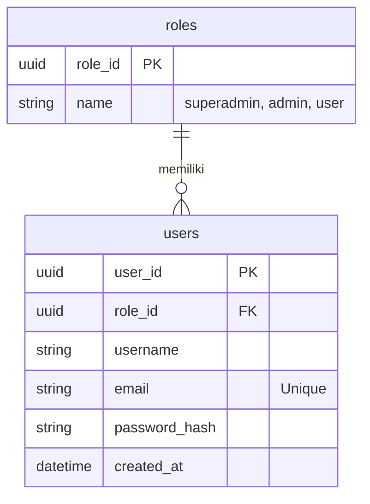

# Panduan Implementasi Autentikasi (JWT) & Role Management

Dokumen ini adalah panduan *step-by-step* untuk membantu Anda mengimplementasikan sistem Autentikasi (Login, Register), JWT (JSON Web Token), dan Role Management (Superadmin, Admin, User) ke dalam BAST Request API.

---

## 1. Desain Database & ERD

Kita akan menambahkan dua tabel baru: `roles` dan `users`.



---

## 2. Instalasi Library yang Dibutuhkan

Buka terminal di root proyek Anda, lalu jalankan perintah ini untuk menginstal pustaka enkripsi password (Bcrypt) dan JWT:

```bash
go get -u golang.org/x/crypto/bcrypt
go get -u github.com/golang-jwt/jwt/v5
```

---

## 3. Langkah 1: Buat Model Database

Buat dua file baru di folder `internal/models/`.

**`internal/models/role.go`**
```go
package models

import (
	"github.com/google/uuid"
	"gorm.io/gorm"
)

type Role struct {
	RoleID uuid.UUID `gorm:"type:uuid;primary_key"`
	Name   string    `gorm:"type:varchar(50);unique;not null"` // "superadmin", "admin", "user"
}

func (r *Role) BeforeCreate(tx *gorm.DB) (err error) {
	if r.RoleID == uuid.Nil {
		r.RoleID = uuid.New()
	}
	return
}
```

**`internal/models/user.go`**
```go
package models

import (
	"time"
	"github.com/google/uuid"
	"gorm.io/gorm"
)

type User struct {
	UserID       uuid.UUID `gorm:"type:uuid;primary_key"`
	RoleID       uuid.UUID `gorm:"type:uuid;not null"`
	Role         Role      `gorm:"foreignKey:RoleID"`
	Username     string    `gorm:"type:varchar(100);not null"`
	Email        string    `gorm:"type:varchar(100);uniqueIndex;not null"`
	PasswordHash string    `gorm:"type:varchar(255);not null"`
	CreatedAt    time.Time
}

func (u *User) BeforeCreate(tx *gorm.DB) (err error) {
	if u.UserID == uuid.Nil {
		u.UserID = uuid.New()
	}
	return
}
```

> [!IMPORTANT]
> Jangan lupa daftarkan kedua model ini di `internal/config/database.go` pada fungsi `AutoMigrate()` agar tabelnya terbentuk otomatis!

---

## 4. Langkah 2: Buat Utility JWT & Hash

Buat folder baru `internal/utils/` dan buat dua file pembantu.

**`internal/utils/hash.go` (Untuk Enkripsi Password)**
```go
package utils

import "golang.org/x/crypto/bcrypt"

// HashPassword mengenkripsi password plain text
func HashPassword(password string) (string, error) {
	bytes, err := bcrypt.GenerateFromPassword([]byte(password), 14)
	return string(bytes), err
}

// CheckPasswordHash mengecek apakah password sesuai dengan hash di DB
func CheckPasswordHash(password, hash string) bool {
	err := bcrypt.CompareHashAndPassword([]byte(hash), []byte(password))
	return err == nil
}
```

**`internal/utils/jwt.go` (Untuk Generate & Validasi Token)**
```go
package utils

import (
	"time"
	"github.com/golang-jwt/jwt/v5"
)

var jwtKey = []byte("SECRET_KEY_YANG_SANGAT_RAHASIA") // Ganti dengan secret key dari Environment Variable (ENV)

type Claims struct {
	UserID string `json:"user_id"`
	Role   string `json:"role"`
	jwt.RegisteredClaims
}

// GenerateToken membuat token baru saat user berhasil login
func GenerateToken(userID string, roleName string) (string, error) {
	expirationTime := time.Now().Add(24 * time.Hour)
	claims := &Claims{
		UserID: userID,
		Role:   roleName,
		RegisteredClaims: jwt.RegisteredClaims{
			ExpiresAt: jwt.NewNumericDate(expirationTime),
		},
	}
	token := jwt.NewWithClaims(jwt.SigningMethodHS256, claims)
	return token.SignedString(jwtKey)
}
```

---

## 5. Langkah 3: Buat Repositori & Service

Buat `UserRepository` dan `AuthService` untuk menangani logika mencari user dari email, melakukan *insert* user baru, mengecek password, dan menghasilkan token.

- **`internal/repositories/user_repository.go`**: Berisi fungsi `FindByEmail(email string)` dan `Create(user *models.User)`.
- **`internal/services/auth_service.go`**: Berisi fungsi `Login(email, password)` dan `Register(username, email, password, role_id)`. Gunakan `utils.HashPassword` saat Register, dan `utils.CheckPasswordHash` saat Login.

---

## 6. Langkah 4: Buat Auth Handler & Rute

Buat `internal/handlers/auth_handler.go` yang akan menerima request POST.

```go
type AuthHandler struct { ... }

func (h *AuthHandler) Login(c *gin.Context) {
    // 1. Terima struct email & password
    // 2. Panggil AuthService.Login(email, password)
    // 3. Jika gagal, kembalikan 401 Unauthorized
    // 4. Jika sukses, kembalikan token ke user (JSON)
}
```

Di `internal/routes/routes.go`, daftarkan rute publik (tidak butuh token):
```go
api.POST("/auth/register", authHandler.Register)
api.POST("/auth/login", authHandler.Login)
```

---

## 7. Langkah 5: Lindungi Rute Anda (Middleware)

Sekarang JWT sudah bisa dikeluarkan saat login, bagaimana cara kita mengamankan endpoint lain (seperti GET /projects)? Kita butuh **Middleware**.

Buat folder `internal/middlewares/` dan buat `auth_middleware.go`:

```go
package middlewares

import (
	"net/http"
	"strings"
	"github.com/gin-gonic/gin"
	"bast-request/internal/utils" // Asumsi Anda membuat fungsi ValidateToken di utils
)

// RequireAuth memblokir user yang tidak membawa Token JWT valid
func RequireAuth() gin.HandlerFunc {
	return func(c *gin.Context) {
		authHeader := c.GetHeader("Authorization")
		if authHeader == "" {
			c.AbortWithStatusJSON(http.StatusUnauthorized, gin.H{"error": "Authorization header is required"})
			return
		}

		tokenString := strings.Replace(authHeader, "Bearer ", "", 1)
		claims, err := utils.ValidateToken(tokenString) // Anda perlu membuat fungsi ini di utils/jwt.go
		if err != nil {
			c.AbortWithStatusJSON(http.StatusUnauthorized, gin.H{"error": "Invalid token"})
			return
		}

		// Simpan data User & Role ke dalam context agar bisa dibaca oleh Handler nanti
		c.Set("userID", claims.UserID)
		c.Set("userRole", claims.Role)
		c.Next()
	}
}

// RequireRole memblokir user yang rolenya tidak sesuai
func RequireRole(allowedRoles ...string) gin.HandlerFunc {
	return func(c *gin.Context) {
		userRole, _ := c.Get("userRole")
		
		isAllowed := false
		for _, role := range allowedRoles {
			if role == userRole {
				isAllowed = true
				break
			}
		}

		if !isAllowed {
			c.AbortWithStatusJSON(http.StatusForbidden, gin.H{"error": "Anda tidak memiliki akses (Forbidden)"})
			return
		}
		c.Next()
	}
}
```

---

## 8. Mengaplikasikan Middleware di Routing

Buka kembali `internal/routes/routes.go`. Buat grup rute yang dilindungi.

```go
// Endpoint Publik
api.POST("/auth/login", authHandler.Login)

// Endpoint Terlindungi (Semua butuh Token JWT valid)
protected := api.Group("/")
protected.Use(middlewares.RequireAuth()) 
{
    // Bisa diakses oleh siapapun asalkan punya Token
    protected.GET("/projects", projectHandler.GetAllProjects)
    
    // Hanya bisa diakses oleh Superadmin dan Admin
    adminOnly := protected.Group("/")
    adminOnly.Use(middlewares.RequireRole("superadmin", "admin"))
    {
        adminOnly.POST("/projects", projectHandler.CreateProject)
        adminOnly.DELETE("/customers/:id", customerHandler.DeleteCustomer)
    }
}
```

---

### Kesimpulan Alur:
1. User **Register** (Password di-*hash* dengan Bcrypt dan masuk ke DB).
2. User **Login** (Email & Password dicek, lalu server mengembalikan Token JWT).
3. User mengirimkan Token tersebut di bagian Header HTTP: `Authorization: Bearer <TOKEN>` setiap kali meminta data (contoh saat memanggil `GET /api/projects`).
4. **Middleware** akan mengecek apakah token itu asli/kadaluarsa. Jika ya, request akan diteruskan. Jika rolenya tidak cocok, middleware akan otomatis memotong (Abort) dan mengembalikan pesan `Forbidden`.
