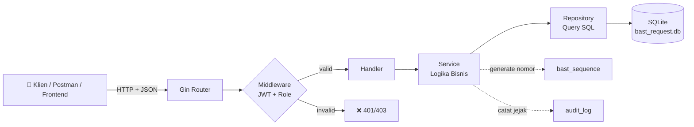

# Gambaran Umum — BAST Request API

Dokumen ini adalah titik awal Anda mengenal **BAST Request API**: apa fungsinya, fitur apa saja yang ditawarkan, teknologi di baliknya, dan bagaimana alur kerjanya secara garis besar.

---

## 1. Apa Itu BAST Request API?

**BAST Request API** adalah sistem berbasis *REST API* yang dibangun dengan **Golang** untuk mengelola pembuatan dan permintaan **Berita Acara Serah Terima (BAST)** secara otomatis.

**BAST** sendiri adalah dokumen resmi serah-terima barang/jasa yang umum dipakai di dunia bisnis & proyek. Di banyak perusahaan, penomoran BAST masih dilakukan manual — rawan ganda, lambat, dan sulit diaudit. Aplikasi ini mengotomatiskan proses tersebut sehingga:

- Setiap nomor BAST **unik dan berurutan** secara otomatis.
- Penomoran **kebal dari race condition** (aman meski dipencet bersamaan).
- Seluruh aktivitas tercatat dalam **audit trail** untuk transparansi.
- Hak akses dikendalikan via **role** (Superadmin, Admin, User).

---

## 2. Fitur Utama

| Fitur | Penjelasan |
|---|---|
| 🔢 **Penomoran Otomatis (Atomic Sequence)** | Pembuatan nomor BAST berurutan & anti-bentrok berkat *Database Transactions* + *row locking*. Lihat [Deep Dive Penomoran](../guides/bast-numbering-deep-dive.md). |
| 🔐 **Role-Based Access Control (RBAC)** | Login & registrasi memakai **JWT**, dengan proteksi level pengguna: `superadmin`, `admin`, `user`. Lihat [Panduan Autentikasi](../guides/authentication-guide.md). |
| 🗂️ **Master Data Terpusat** | CRUD untuk `Customer`, `Project`, dan `Format Penomoran BAST`. |
| 📜 **Audit Trail Log** | Setiap perubahan krusial tercatat otomatis dengan rekaman data *sebelum* dan *sesudah* (`old_data` / `new_data`). |
| 📘 **Auto-Generated Documentation** | Terintegrasi penuh dengan **Swagger UI** — skema API ter-generate dari komentar kode. |
| 🧱 **Clean Architecture** | Pemisahan tanggung jawab yang ketat antar layer, agar kode mudah diuji & dirawat. |

---

## 3. Teknologi yang Digunakan

| Kategori | Teknologi | Keterangan |
|---|---|---|
| Bahasa | [**Go (Golang)**](https://go.dev/) | Versi `1.20+` (lihat `go.mod`) |
| Web Framework | [**Gin Gonic**](https://gin-gonic.com/) | Routing HTTP yang sangat cepat |
| ORM & Database | [**GORM**](https://gorm.io/) + [**SQLite (pure Go)**](https://github.com/glebarez/sqlite) | Tanpa CGO, langsung jalan tanpa instal DB eksternal |
| Keamanan | [**golang-jwt/jwt**](https://github.com/golang-jwt/jwt) + [**bcrypt**](https://pkg.go.dev/golang.org/x/crypto/bcrypt) | Token JWT & hashing password |
| ID Unik | [**google/uuid**](https://github.com/google/uuid) | Primary key UUID untuk semua tabel |
| Dokumentasi | [**swaggo/swag**](https://github.com/swaggo/swag) | Generate OpenAPI/Swagger dari komentar |

> **Kenapa SQLite murni (tanpa CGO)?** Agar Anda bisa langsung `go run` tanpa perlu menginstal compiler C (GCC). Cukup satu perintah, database file `bast_request.db` langsung dibuat otomatis.

---

## 4. Skema Singkat Alur Aplikasi

Inti alurnya: **Request → Router → Middleware (cek token) → Handler → Service → Repository → Database**. Detail lengkap di [Clean Architecture](../architecture/clean-architecture.md).

---

## 5. Apa yang Bisa Anda Lakukan dengan API Ini?

Beberapa skenario penggunaan:

1. **Admin membuat master data** → daftarkan *Customer* & *Project* baru.
2. **Admin mendefinisikan format nomor** → mis. `BAST/INT/{YYYY}/{MM}/{SEQ}`.
3. **User meminta nomor BAST** → kirim request, sistem generate nomor unik secara atomik.
4. **User menandai pemakaian** → ubah status BAST: `Active` → `Used`/`Void`.
5. **Superadmin meninjau audit** → lihat siapa melakukan apa, kapan, dan data apa yang berubah.

---

## 6. Langkah Selanjutnya

Sekarang setelah Anda tahu apa ini, saatnya **menjalankannya** di komputer Anda:

➡️ **Lanjut ke: [Panduan Instalasi](installation.md)**
