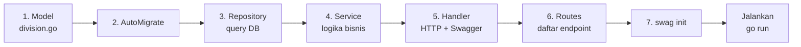

# Panduan: Menambahkan Fitur/Modul Baru

Tutorial praktis cara menambahkan **satu modul baru** (contoh: tabel `Division`) ke aplikasi, mengikuti pola **Clean Architecture** yang sama. Dari level paling bawah (Model) sampai paling atas (Route + Swagger).

> 🎯 Setelah menguasai pola 7 langkah ini, Anda bisa menambah fitur apa pun dengan cepat.

---

## Prinsip Utama

Setiap modul baru butuh **5 file baru + 1 edit**:

```text
1. internal/models/<nama>.go              (Model/Struct)
2. internal/repositories/<nama>_repository.go   (Query DB)
3. internal/services/<nama>_service.go          (Logika Bisnis)
4. internal/handlers/<nama>_handler.go          (HTTP Handler)
5. internal/routes/routes.go              (EDIT: daftarkan rute)
(+ edit internal/config/database.go: AutoMigrate)
```

Pola berulang ini adalah inti Clean Architecture: **per feature, satu set file**.

---

## Contoh: Menambahkan Modul `Division`

Kita akan membuat tabel `divisions` (data divisi perusahaan) dengan CRUD sederhana.

### Langkah 1: Buat Model

Buat file **`internal/models/division.go`**:

```go
package models

import (
	"time"

	"github.com/google/uuid"
	"gorm.io/gorm"
)

type Division struct {
	DivisionID   uuid.UUID      `gorm:"type:uuid;primary_key"`
	DivisionCode string         `gorm:"type:varchar(20);uniqueIndex;not null"`
	DivisionName string         `gorm:"type:varchar(100);not null"`
	Status       string         `gorm:"type:varchar(50);default:'active'"`
	CreatedAt    time.Time
	UpdatedAt    time.Time
	DeletedAt    gorm.DeletedAt `gorm:"index"`
}

// Override nama tabel
func (Division) TableName() string {
	return "master_division"
}

// Hook: isi UUID otomatis
func (d *Division) BeforeCreate(tx *gorm.DB) (err error) {
	if d.DivisionID == uuid.Nil {
		d.DivisionID = uuid.New()
	}
	return
}
```

**Checklist model:**
- ✅ Primary key UUID + hook `BeforeCreate`.
- ✅ Tag GORM lengkap (`type`, `not null`, `uniqueIndex`, `default`).
- ✅ `TableName()` agar nama tabel konsisten.
- ✅ `DeletedAt` untuk soft delete (opsional).

---

### Langkah 2: Daftarkan di AutoMigrate

Edit **`internal/config/database.go`**, fungsi `AutoMigrate()`:

```go
func AutoMigrate() {
	err := DB.AutoMigrate(
		&models.Customer{},
		&models.Project{},
		// ... yang lain ...
		&models.Division{},   // ← TAMBAHKAN INI
	)
	// ...
}
```

Tanpa ini, tabel tidak akan dibuat.

---

### Langkah 3: Buat Repository

Buat file **`internal/repositories/division_repository.go`**:

```go
package repositories

import (
	"bast-request/internal/models"
	"gorm.io/gorm"
)

type DivisionRepository struct {
	db *gorm.DB
}

func NewDivisionRepository(db *gorm.DB) *DivisionRepository {
	return &DivisionRepository{db: db}
}

func (r *DivisionRepository) FindAll(status string) ([]models.Division, error) {
	var divisions []models.Division
	query := r.db.Model(&models.Division{})
	if status != "" {
		query = query.Where("status = ?", status)
	}
	err := query.Find(&divisions).Error
	return divisions, err
}

func (r *DivisionRepository) FindByID(id string) (models.Division, error) {
	var division models.Division
	err := r.db.First(&division, "division_id = ?", id).Error
	return division, err
}

func (r *DivisionRepository) Create(division *models.Division) error {
	return r.db.Create(division).Error
}

func (r *DivisionRepository) Update(division *models.Division) error {
	return r.db.Save(division).Error
}

func (r *DivisionRepository) Delete(id string) error {
	return r.db.Model(&models.Division{}).
		Where("division_id = ?", id).
		Update("status", "inactive").Error
}
```

**Checklist repository:**
- ✅ Konstruktor `New...Repository(db)` (dependency injection).
- ✅ Pakai parameter binding `?` (anti SQL injection).
- ✅ Semua method return `error` (pola Go).

---

### Langkah 4: Buat Service

Buat file **`internal/services/division_service.go`**:

```go
package services

import (
	"errors"

	"bast-request/internal/models"
	"bast-request/internal/repositories"
)

type DivisionService struct {
	repo *repositories.DivisionRepository
}

func NewDivisionService(repo *repositories.DivisionRepository) *DivisionService {
	return &DivisionService{repo: repo}
}

func (s *DivisionService) GetAllDivisions(status string) ([]models.Division, error) {
	return s.repo.FindAll(status)
}

func (s *DivisionService) GetDivisionByID(id string) (models.Division, error) {
	return s.repo.FindByID(id)
}

func (s *DivisionService) CreateDivision(div *models.Division) error {
	// Validasi bisnis
	if div.DivisionName == "" {
		return errors.New("division_name tidak boleh kosong")
	}
	if div.DivisionCode == "" {
		return errors.New("division_code tidak boleh kosong")
	}
	return s.repo.Create(div)
}

func (s *DivisionService) UpdateDivision(id string, input *models.Division) (models.Division, error) {
	div, err := s.repo.FindByID(id)
	if err != nil {
		return div, err
	}
	div.DivisionCode = input.DivisionCode
	div.DivisionName = input.DivisionName
	div.Status = input.Status
	err = s.repo.Update(&div)
	return div, err
}

func (s *DivisionService) DeleteDivision(id string) error {
	return s.repo.Delete(id)
}
```

**Checklist service:**
- ✅ Validasi bisnis di sini (bukan di handler/repository).
- ✅ Update: ambil existing → timpa field → save.
- ✅ Konstruktor menerima repository.

---

### Langkah 5: Buat Handler (dengan Swagger Anotasi!)

Buat file **`internal/handlers/division_handler.go`**:

```go
package handlers

import (
	"net/http"

	"bast-request/internal/models"
	"bast-request/internal/services"

	"github.com/gin-gonic/gin"
)

type DivisionHandler struct {
	service *services.DivisionService
}

func NewDivisionHandler(service *services.DivisionService) *DivisionHandler {
	return &DivisionHandler{service: service}
}

// GetAllDivisions godoc
// @Summary Get all divisions
// @Description Retrieve a list of divisions, optionally filtered by status
// @Tags divisions
// @Produce json
// @Param status query string false "Status filter"
// @Success 200 {array} models.Division
// @Failure 500 {object} map[string]interface{}
// @Router /divisions [get]
func (h *DivisionHandler) GetAllDivisions(c *gin.Context) {
	status := c.Query("status")
	divisions, err := h.service.GetAllDivisions(status)
	if err != nil {
		c.JSON(http.StatusInternalServerError, gin.H{"error": err.Error()})
		return
	}
	c.JSON(http.StatusOK, divisions)
}

// CreateDivision godoc
// @Summary Create a new division
// @Description Add a new division
// @Tags divisions
// @Accept json
// @Produce json
// @Param division body models.Division true "Division Data"
// @Success 201 {object} models.Division
// @Failure 400 {object} map[string]interface{}
// @Failure 500 {object} map[string]interface{}
// @Router /divisions [post]
func (h *DivisionHandler) CreateDivision(c *gin.Context) {
	var input models.Division
	if err := c.ShouldBindJSON(&input); err != nil {
		c.JSON(http.StatusBadRequest, gin.H{"error": err.Error()})
		return
	}
	if err := h.service.CreateDivision(&input); err != nil {
		c.JSON(http.StatusBadRequest, gin.H{"error": err.Error()})
		return
	}
	c.JSON(http.StatusCreated, input)
}
```

(Tambahkan `GetByID`, `Update`, `Delete` dengan pola yang sama — lihat [`customer_handler.go`](../../internal/handlers/customer_handler.go) sebagai template lengkap.)

**Checklist handler:**
- ✅ Anotasi Swagger lengkap (`@Summary`, `@Router`, dll).
- ✅ `ShouldBindJSON` untuk body, `c.Query`/`c.Param` untuk parameter.
- ✅ Cek error di setiap langkah → balas kode HTTP yang tepat.

---

### Langkah 6: Daftarkan di Routes

Edit **`internal/routes/routes.go`**, di awal `SetupRoutes`:

```go
// Dependency Injection
divisionRepo := repositories.NewDivisionRepository(db)
divisionService := services.NewDivisionService(divisionRepo)
divisionHandler := handlers.NewDivisionHandler(divisionService)
```

Lalu di dalam grup `protected`:
```go
protected := api.Group("/")
protected.Use(middlewares.RequireAuth())
{
	// ... rute lain ...

	// MASTER DIVISION
	protected.GET("/divisions", divisionHandler.GetAllDivisions)
	protected.GET("/divisions/:id", divisionHandler.GetDivisionByID)
	protected.POST("/divisions", divisionHandler.CreateDivision)
	protected.PUT("/divisions/:id", divisionHandler.UpdateDivision)
	protected.DELETE("/divisions/:id", divisionHandler.DeleteDivision)
}
```

**Tips memilih tingkat akses:**
- Endpoint umum (GET semua role) → di `protected`.
- Khusus admin (mis. POST/DELETE) → pindah ke grup `adminOnly`.

---

### Langkah 7: Generate Swagger & Jalankan

```bash
# Regenerasi dokumentasi
swag init -g cmd/api/main.go --parseDependency --parseInternal

# Jalankan server
go run ./cmd/api/main.go
```

Cek hasil:
- Buka **http://localhost:8080/swagger/index.html** → section "divisions" muncul.
- Tabel `master_division` otomatis terbuat di DB.

---

## Template Cepat (Cheat Sheet)

Untuk modul `<X>` dengan model `<X>`:

| Layer | File | Constructor |
|---|---|---|
| Model | `models/<x>.go` | (hook `BeforeCreate`) |
| Repo | `repositories/<x>_repository.go` | `New<X>Repository(db)` |
| Service | `services/<x>_service.go` | `New<X>Service(repo)` |
| Handler | `handlers/<x>_handler.go` | `New<X>Handler(service)` |
| Routes | edit `routes/routes.go` | daftar di `protected` |
| Migrate | edit `config/database.go` | tambah `&models.<X>{}` |
| Swagger | terminal | `swag init` |

---

## Studi Kasus: Tambah Field Baru ke Modul Ada

Misal: tambah kolom `phone` ke `Customer`.

1. **Edit model** `internal/models/customer.go`:
   ```go
   Phone string `gorm:"type:varchar(20)"`
   ```
2. **Restart server** → AutoMigrate akan **menambahkan kolom** ke tabel (tanpa hapus data).
3. **Update service** `UpdateCustomer` agar field ikut di-timpa:
   ```go
   customer.Phone = input.Phone
   ```
4. **Regenerasi Swagger**: `swag init`.

> ⚠️ AutoMigrate **tidak menghapus** kolom. Untuk drop kolom, butuh migrasi manual.

---

## Tips & Jebakan

✅ **Lakukan:**
- Copy-paste file `customer_*` sebagai template awal, lalu ganti nama.
- Selalu jalankan `swag init` setelah ubah handler.
- Tulis validasi bisnis di **service**, bukan handler.

❌ **Hindari:**
- Memakai `gorm` langsung di handler/service (harus lewat repository).
- Lupa mendaftarkan model di `AutoMigrate` → tabel tidak terbuat.
- Lupa import `_ "bast-request/docs"` kalau Swagger mendadak kosong.
- Hardcode magic string; pakai konstanta untuk status (`active`, `inactive`).

---

## Ringkasan Alur



---

## Bacaan Lanjutan
- 🛠️ [Tutorial Step 4 — Master Data CRUD](../tutorials/step-04-master-data-crud.md) (pola detail)
- 🏗️ [Clean Architecture](../architecture/clean-architecture.md)
- 📖 [Referensi Customer Endpoint](../api-reference/customer-endpoints.md) (contoh respons)
