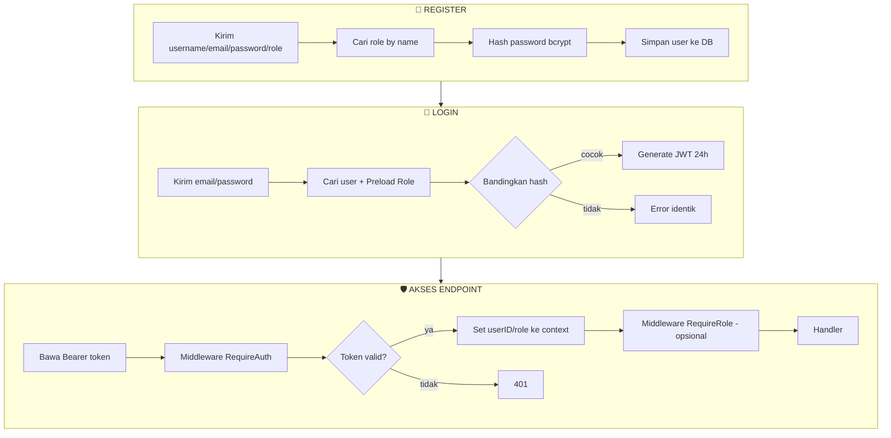

# Panduan Autentikasi & RBAC — End-to-End

Panduan menyeluruh tentang sistem keamanan aplikasi: bagaimana user mendaftar & login, bagaimana token JWT dibuat & diverifikasi, dan bagaimana hak akses berbasis role (RBAC) diterapkan.

> 📚 Ini pendalaman dari [Tutorial Step 3](../tutorials/step-03-authentication-jwt.md). Untuk detail endpoint, lihat [Referensi Auth](../api-reference/auth-endpoints.md).

---

## 1. Gambaran Arsitektur Autentikasi



---

## 2. Komponen Sistem

| Komponen | File | Tugas |
|---|---|---|
| Model | [`internal/models/role.go`](../../internal/models/role.go), [`user.go`](../../internal/models/user.go) | Struktur tabel `roles` & `users` |
| DTO | [`internal/models/auth.go`](../../internal/models/auth.go) | `LoginRequest`, `RegisterRequest` |
| Utils | [`internal/utils/hash.go`](../../internal/utils/hash.go), [`jwt.go`](../../internal/utils/jwt.go) | Bcrypt & JWT |
| Repository | [`internal/repositories/auth_repository.go`](../../internal/repositories/auth_repository.go) | Query user/role |
| Service | [`internal/services/auth_service.go`](../../internal/services/auth_service.go) | Logika Register/Login |
| Handler | [`internal/handlers/auth_handler.go`](../../internal/handlers/auth_handler.go) | HTTP endpoint |
| Middleware | [`internal/middlewares/auth_middleware.go`](../../internal/middlewares/auth_middleware.go) | Cek token & role |

---

## 3. Role yang Tersedia

Di-seed otomatis di [`internal/config/seed.go:16-26`](../../internal/config/seed.go):

| Role | Tingkat | Akses |
|---|---|---|
| `superadmin` | Tertinggi | Semua endpoint |
| `admin` | Menengah | Endpoint umum + admin-only |
| `user` | Dasar | Endpoint umum saja |

---

## 4. Detail Bcrypt — Kenapa Cost 14?

[`internal/utils/hash.go:6`](../../internal/utils/hash.go):
```go
bytes, err := bcrypt.GenerateFromPassword([]byte(password), 14)
```

Angka `14` adalah **cost factor**. Artinya algoritma melakukan `2^14 = 16.384` putaran iterasi hash. Semakin tinggi:
- ✅ Semakin **aman** (lambat = tahan brute-force).
- ❌ Semakin **berat CPU** tiap login.

Standar umum saat ini: 10–14. Untuk produksi high-traffic, pertimbangkan menurunkan atau pakai algoritma lain (argon2id). **Jangan turunkan di bawah 10.**

> ⚠️ Anda **tidak bisa** mengubah cost tanpa re-hash. Jadi semua user harus reset password bila cost diganti.

---

## 5. Detail JWT — Apa yang Ada di Dalamnya?

[`internal/utils/jwt.go`](../../internal/utils/jwt.go) membuat token dengan payload (`Claims`):
```go
type Claims struct {
	UserID string `json:"user_id"`
	Role   string `json:"role"`
	jwt.RegisteredClaims
}
```

Token hasilnya (`xxx.yyy.zzz`) berisi 3 bagian:
1. **Header** — algoritma (HS256).
2. **Payload** — data: `user_id`, `role`, `exp` (kedaluwarsa), `iat` (diterbitkan), `iss` (issuer).
3. **Signature** — tanda tangan HMAC pakai `jwtKey`.

### ⚠️ Peringatan Penting
- Payload JWT **ter-encode base64**, BUKAN terenkripsi. Siapa pun yang pegang token bisa **baca isinya** (decode base64).
- Karena itu: **JANGAN** taruh data sensitif (password, data pribadi) di JWT.
- Yang membuat token "valid" adalah **signature** — hanya server (pegang `jwtKey`) yang bisa membuatnya.

### Secret Key di Kode Saat Ini
[`internal/utils/jwt.go:9`](../../internal/utils/jwt.go):
```go
var jwtKey = []byte("bast-request-secret-key-05")
```

> 🚨 **RISIKO KEAMANAN:** Secret key **hardcode** di kode sumber! Ini sangat berbahaya di produksi karena:
> - Siapa pun yang baca repo bisa memalsukan token.
> - Commit history menyimpan secret lama walau sudah diganti.
>
> **Perbaikan:** Pakai environment variable:
> ```go
> var jwtKey = []byte(os.Getenv("JWT_SECRET"))
> ```
> Set `JWT_SECRET` di environment (panjang, acak, ≥32 byte).

---

## 6. Alur Verifikasi Token (Middleware)

[`internal/middlewares/auth_middleware.go:10-30`](../../internal/middlewares/auth_middleware.go):

```go
func RequireAuth() gin.HandlerFunc {
	return func(c *gin.Context) {
		authHeader := c.GetHeader("Authorization")
		if authHeader == "" {
			c.AbortWithStatusJSON(401, gin.H{"error": "Authorization header is required"})
			return
		}

		tokenString := strings.Replace(authHeader, "Bearer ", "", 1)
		claims, err := utils.ValidateToken(tokenString)
		if err != nil {
			c.AbortWithStatusJSON(401, gin.H{"error": "Invalid token"})
			return
		}

		c.Set("userID", claims.UserID)
		c.Set("userRole", claims.Role)
		c.Next()
	}
}
```

### Logika step-by-step
1. Ambil header `Authorization`.
2. Jika kosong → 401.
3. Strip prefix `"Bearer "` → dapat token mentah.
4. Validasi token (cek signature + kedaluwarsa).
5. Jika invalid → 401.
6. Jika valid → simpan `userID` & `userRole` ke **Gin Context**.
7. `c.Next()` → lanjut ke handler.

### Cara Handler Baca Info User
Setelah middleware set context, handler bisa ambil:
```go
userID, _ := c.Get("userID")
userRole, _ := c.Get("userRole")
```
Berguna untuk: mencatat siapa yang melakukan aksi (audit log), atau personalisasi response.

---

## 7. RBAC — RequireRole

[`internal/middlewares/auth_middleware.go:33-52`](../../internal/middlewares/auth_middleware.go):

```go
func RequireRole(allowedRoles ...string) gin.HandlerFunc {
	return func(c *gin.Context) {
		userRole, _ := c.Get("userRole")

		isAllowed := false
		for _, role := range allowedRoles {
			if role == userRole {
				isAllowed = true
				break
			}
		}

		if isAllowed {
			c.Next()
		} else {
			c.AbortWithStatusJSON(403, gin.H{"error": "Anda tidak memiliki akses (Forbidden)"})
			return
		}
	}
}
```

**Penting:** `RequireRole` **harus** dipasang **setelah** `RequireAuth` — karena ia membaca `userRole` yang di-set oleh `RequireAuth`. Kalau dipasang sendiri, `userRole` akan kosong → semua ditolak.

### Penerapan di routes.go
```go
protected := api.Group("/")
protected.Use(middlewares.RequireAuth())
{
	adminOnly := protected.Group("/")
	adminOnly.Use(middlewares.RequireRole("superadmin", "admin"))
	{
		adminOnly.POST("/projects", projectHandler.CreateProject)
	}
}
```

---

## 8. Celah Keamanan yang Perlu Diperbaiki

### ⚠️ Celah 1: Register publik bisa pilih role apa pun
[`internal/services/auth_service.go:51-54`](../../internal/services/auth_service.go):
```go
role, err := s.authRepo.FindRoleByName(req.Role)
```
Klien mengirim `role` di body → langsung dipakai. Artinya siapa pun bisa register sebagai `superadmin`.

**Perbaikan:** Batasi role yang bisa dipilih saat register publik:
```go
// Hanya izinkan "user" untuk register publik
if req.Role != "user" {
	return "", fmt.Errorf("role tidak diizinkan")
}
```
Role lebih tinggi hanya bisa dibuat via endpoint admin terpisah.

### ⚠️ Celah 2: Secret key hardcode (lihat bagian 5).

### ⚠️ Celah 3: Tidak ada rate limiting
Login tak dibatasi percobaan → rawan brute-force. Pertimbangkan middleware rate limiter (mis. `gin-contrib/limits`).

### ⚠️ Celah 4: Tidak ada refresh token
Saat token kedaluwarsa (24h), user harus login ulang. Sistem refresh token lebih UX-friendly.

---

## 9. Praktik Baik (Best Practices)

✅ **Lakukan:**
- Simpan secret di env variable.
- HTTPS selalu (token via header bisa di-snoop di HTTP).
- Pesan error identik untuk login gagal (anti enumeration).
- Token kedaluwarsa wajar (24h atau lebih pendek).
- Log upaya login gagal (untuk deteksi serangan).

❌ **Hindari:**
- Menyimpan token JWT di localStorage (rawan XSS) — lebih baik httpOnly cookie.
- Token terlalu panjang umur (mis. 30 hari).
- Mempercayai data JWT tanpa verifikasi signature.

---

## 10. Eksperimen: Decode Token Manual

Token JWT bisa di-decode tanpa secret (payload base64). Coba:

```bash
# Asumsi token di variable $TOKEN
echo $TOKEN | cut -d. -f2 | base64 -d 2>/dev/null
```
Output (contoh):
```json
{"user_id":"abc-123","role":"admin","exp":1780000000,"iat":1779900000,"iss":"bast-request"}
```
Ini membuktikan payload **bisa dibaca** siapa pun — jadi jangan taruh rahasia di sana.

---

## 11. Ringkasan Alur End-to-End

1. **Register:** kirim `{username,email,password,role}` → hash bcrypt → simpan user.
2. **Login:** kirim `{email,password}` → cari user → compare hash → generate JWT.
3. **Akses:** bawa `Authorization: Bearer <token>` di setiap request berikutnya.
4. **Verify:** middleware validasi signature + expiry → set context.
5. **Authorize:** middleware role cek hak akses → izinkan/tolak.

---

## Bacaan Lanjutan
- 📘 [RFC 7519 (JWT spec)](https://datatracker.ietf.org/doc/html/rfc7519)
- 🔐 [OWASP Authentication Cheat Sheet](https://cheatsheetseries.owasp.org/cheatsheets/Authentication_Cheat_Sheet.html)
- 🛠️ [Tutorial Step 3 — Autentikasi](../tutorials/step-03-authentication-jwt.md)
- 📖 [Referensi Endpoint Auth](../api-reference/auth-endpoints.md)
