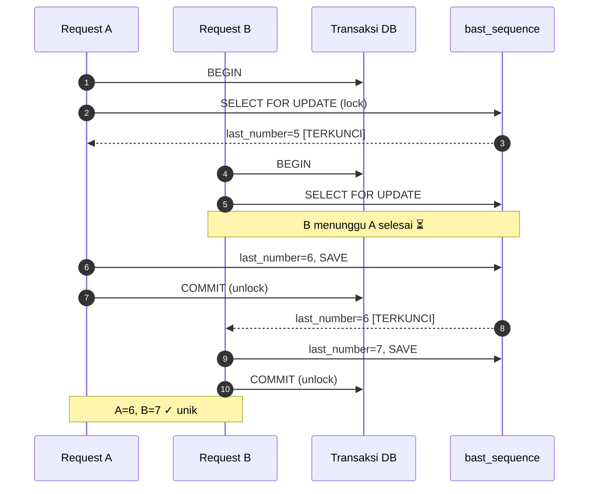

# Deep Dive: Mesin Penomoran BAST

Dokumen ini membahas **sangat mendalam** cara kerja mesin penomoran BAST: koncurrency, transaksi database, *row locking*, format pattern, dan mekanisme reset. Ini pendalaman dari [Tutorial Step 5](../tutorials/step-05-bast-numbering-engine.md).

---

## 1. Mengapa Penomoran Itu Sulit?

Pada pandangan pertama, "ambil nomor urut berikutnya" terdengar sepele:
```
SELECT last_number FROM sequence;
last_number + 1;
UPDATE sequence SET last_number = ?;
```

**Tapi ini salah fatal di sistem konkuren.** Bayangkan 2 request datang di milidetik yang sama:

| Waktu | Request A | Request B |
|---|---|---|
| t1 | `SELECT last_number` → dapat 5 | |
| t2 | | `SELECT last_number` → dapat 5 (belum di-update A!) |
| t3 | `last_number + 1 = 6` | `last_number + 1 = 6` |
| t4 | `UPDATE ... SET 6` | `UPDATE ... SET 6` |

Hasil: **dua-duanya dapat nomor 6** → duplikat! Inilah **race condition**.

---

## 2. Solusi: Transaksi + Row Locking

Aplikasi menyelesaikannya dengan dua lapis:

### Lapis 1: Database Transaction
[`internal/repositories/bast_sequence_repository.go:28-57`](../../internal/repositories/bast_sequence_repository.go):
```go
err := r.db.Transaction(func(tx *gorm.DB) error {
	// semua operasi di sini pakai `tx` (transaksi lokal)
	err := tx.Clauses(clause.Locking{Strength: "UPDATE"}).
		Where("format_id = ? AND year = ? AND month = ?", formatID, year, month).
		First(&seq).Error

	if err != nil { /* ... */ }

	seq.LastNumber++
	if err := tx.Save(&seq).Error; err != nil {
		return err
	}
	return nil
})
```

`r.db.Transaction(func(tx *gorm.DB) error {...})` membungkus blok kode. Karakteristik:
- `tx` adalah *connection lokal* — operasi di dalamnya tidak terlihat connection lain sampai `COMMIT`.
- Jika fungsi return `nil` → `COMMIT` (permanen).
- Jika return `error` → `ROLLBACK` (semua dibatalkan).
- **ACID**: Atomic, Consistent, Isolated, Durable.

### Lapis 2: Row Locking (`FOR UPDATE`)
```go
tx.Clauses(clause.Locking{Strength: "UPDATE"})
```
Ini menambahkan klausa SQL `SELECT ... FOR UPDATE` di belakang layar. Efeknya:
- Baris yang dipilih **terkunci** selama transaksi belum selesai.
- Transaksi lain yang mencoba `SELECT ... FOR UPDATE` di baris sama akan **menunggu** (block) sampai transaksi pertama `COMMIT`/`ROLLBACK`.

### Hasil Akhir

| Waktu | Request A | Request B |
|---|---|---|
| t1 | `BEGIN; SELECT ... FOR UPDATE` → dapat 5, **kunci baris** | |
| t2 | | `BEGIN; SELECT ... FOR UPDATE` → **menunggu** ⏳ |
| t3 | `last_number = 6; SAVE; COMMIT` → lepas kunci | |
| t4 | | dapat 6 (versi baru!), **kunci baris** |
| t5 | | `last_number = 7; SAVE; COMMIT` |

✅ A dapat 6, B dapat 7. **Tidak ada duplikat.**

> ⚠️ **Catatan SQLite:** SQLite mendukung transaksi tapi implementasi `FOR UPDATE` berbeda dari PostgreSQL (SQLite pakai locking level DB/file). Untuk konkurensi tinggi, **PostgreSQL/MySQL lebih direkomendasikan**. Konsepnya tetap sama.

---

## 3. Diagram Sequence Race Condition (Diselesaikan)



---

## 4. Format Pattern — Pengganti Placeholder

[`internal/services/bast_request_service.go:54-60`](../../internal/services/bast_request_service.go):
```go
bastNum := format.FormatPattern
bastNum = strings.ReplaceAll(bastNum, "{YYYY}", fmt.Sprintf("%04d", year))
bastNum = strings.ReplaceAll(bastNum, "{MM}", fmt.Sprintf("%02d", month))
bastNum = strings.ReplaceAll(bastNum, "{SEQ}", fmt.Sprintf("%04d", nextNum))
```

### Daftar Placeholder
| Placeholder | Contoh Output | Penjelasan |
|---|---|---|
| `{YYYY}` | `2026` | Tahun, 4 digit |
| `{MM}` | `06` | Bulan, 2 digit (zero-padded) |
| `{SEQ}` | `0007` | Nomor urut, 4 digit (zero-padded) |

### Padding dengan `fmt.Sprintf`
- `fmt.Sprintf("%04d", 7)` → `"0007"` (minimal 4 digit, diisi nol di depan).
- `fmt.Sprintf("%02d", 6)` → `"06"`.
- Jika nomor melebihi 4 digit (mis. 12345), `%04d` tetap menampilkan semua: `"12345"` (tidak dipotong).

### Contoh Transformasi
Pattern: `BAST/INT/{YYYY}/{MM}/{SEQ}`
- Tahun 2026, bulan Juni (6), nomor urut 1 → `BAST/INT/2026/06/0001`
- Nomor urut 23 → `BAST/INT/2026/06/0023`

### Custom Pattern
Admin bisa buat format lain via `POST /api/bast-formats`:
- `BAST/PO/{YYYY}/{SEQ}` → `BAST/PO/2026/0001`
- `{YYYY}-{MM}-INT-{SEQ}` → `2026-06-INT-0001`

Yang penting: pakai placeholder `{YYYY}`, `{MM}`, `{SEQ}`.

---

## 5. Reset Sequence

[`internal/services/bast_sequence_service.go:23-41`](../../internal/services/bast_sequence_service.go):
```go
func (s *BastSequenceService) ResetSequence(formatID string, year int, month int, lastNumber int) (models.BastSequence, error) {
	seq, err := s.repo.FindSequence(formatID, year, month)
	if err != nil {
		// Belum ada → buat baru
		uid, _ := uuid.Parse(formatID)
		seq = models.BastSequence{
			FormatID:   uid,
			Year:       year,
			Month:      month,
			LastNumber: lastNumber,
		}
		err = s.repo.Create(&seq)
		return seq, err
	}

	// Sudah ada → timpa last_number
	seq.LastNumber = lastNumber
	err = s.repo.Update(&seq)
	return seq, err
}
```

Endpoint `POST /api/bast-sequences/reset` memakai ini. Skenario pakai:
- **Koreksi nomor salah** → admin set manual.
- **Migrasi data** → lanjut dari nomor tertentu.
- **Testing** → reset ke 0 untuk eksperimen.

> ⚠️ Reset berbahaya: bisa menyebabkan nomor ganda jika diset lebih rendah dari nomor yang sudah terpakai. Hanya admin yang boleh.

---

## 6. Dua Tipe Nomor: Internal vs PO

[`internal/services/bast_request_service.go:42-68`](../../internal/services/bast_request_service.go):

| Tipe | Cara Dapat Nomor | Contoh |
|---|---|---|
| `Internal` | Auto-generate via sequence | `BAST/INT/2026/06/0001` |
| `PO` | Pakai `po_number` dari klien | `PO/2026/001` |

Untuk `PO`, **tidak** memakai sequence (tidak increment). Tapi `bast_number` tetap harus unik (unique index di tabel `bast_request`).

> 💡 **Validasi penting:** jika `tipe_nomor = PO` tapi `po_number` kosong → error "po_number is required".

---

## 7. Reset Otomatis Tiap Bulan

Salah satu fitur elegan: nomor urut **otomatis reset ke 1** setiap ganti bulan. Bagaimana caranya?

Karena `bast_sequence` punya unique index komposit `(format_id, year, month)`:
- Bulan Juni 2026 → baris dengan kombinasi `(fmt, 2026, 6)`.
- Tanggal 1 Juli → kombinasi baru `(fmt, 2026, 7)` → belum ada → service buat baru dengan `last_number = 1`.

Lihat [`internal/services/bast_sequence_service.go:43-67`](../../internal/services/bast_sequence_service.go):
```go
func (s *BastSequenceService) GenerateNextNumber(...) (int, error) {
	nextNumber, err := s.repo.IncrementAndGet(...)
	if err != nil {
		if err.Error() == "record not found" {
			// Belum ada sequence untuk bulan ini → buat baru mulai dari 1
			seq := models.BastSequence{..., LastNumber: 1}
			s.repo.Create(&seq)
			return 1, nil
		}
	}
	return nextNumber, nil
}
```

Tanpa cron job, tanpa scheduler — cuma andalkan struktur data. ✨

---

## 8. Eksperimen: Simulasi Race Condition

Untuk **membuktikan** sistem anti-bentrok:

### Pakai tool load testing (mis. `hey` atau `ab`)
```bash
# Install hey: go install github.com/rakyll/hey@latest
# Kirim 50 request paralel ke endpoint create BAST
hey -n 50 -c 10 -m POST \
  -H "Authorization: Bearer <TOKEN>" \
  -H "Content-Type: application/json" \
  -d '{"customer_id":"...","project_id":"...","format_id":"...","perihal":"test","tipe_nomor":"Internal","requested_by":"test"}' \
  http://localhost:8080/api/bast-requests
```

Lalu cek hasil:
```bash
curl -H "Authorization: Bearer <TOKEN>" http://localhost:8080/api/bast-requests | jq '.[].bast_number'
```
Anda akan lihat 50 nomor **unik berurutan** (`0001`, `0002`, ..., `0050`). Tidak ada ganda.

> ⚠️ Tanpa locking, eksperimen ini akan menghasilkan duplikat. Coba matikan `clause.Locking` (hanya untuk belajar!) dan ulangi — Anda akan lihat bug.

---

## 9. Tabel BastRequest — Penyimpanan Final

[`internal/models/bast_request.go:21`](../../internal/models/bast_request.go):
```go
BastNumber string `gorm:"type:varchar(100);not null;uniqueIndex"`
```

`uniqueIndex` di `bast_number` adalah **lapis pertahanan terakhir**: walapun race condition lolos (mis. locking tidak dipakai), database akan **menolak** insert nomor duplikat dengan error. Aplikasi akan dapat error → bisa di-retry.

Pertahanan berlapis (*defense in depth*):
1. **Application locking** (transaksi + FOR UPDATE) — mencegah di awal.
2. **Database unique index** — mencegah di akhir kalau lapis 1 gagal.

---

## 10. Potensi Perbaikan

| Area | Sekarang | Saran |
|---|---|---|
| Transaksi antar service | `CreateRequest` tidak wrap insert BAST + sequence dalam 1 transaksi | Wrap dalam `db.Transaction` agar kalau insert BAST gagal, sequence di-rollback |
| Padding SEQ | Hardcode `%04d` | Jadikan config per format (`seq_padding`) |
| Tipe tanggal | Pakai `time.Now()` server | Izinkan override tanggal (untuk backdate) |
| Konkurensi SQLite | locking level file | Pindah PostgreSQL untuk production concurrent |

### Saran Penting: Transaksi Lengkap
Saat ini, `IncrementAndGet` (sequence) ter-commit **sebelum** `repo.Create(req)` (BAST). Jika insert BAST gagal, **nomor sequence sudah ter-pakai** → ada gap nomor.

**Perbaikan:** bungkus keduanya dalam satu transaksi:
```go
err := db.Transaction(func(tx *gorm.DB) error {
	nextNum := incrementSequence(tx, ...)
	saveBastRequest(tx, ...)
	return nil
})
```

---

## 11. Ringkasan

| Konsep | Implementasi |
|---|---|
| Anti race condition | `db.Transaction` + `clause.Locking{Strength:"UPDATE"}` |
| Reset bulanan | Unique index komposit `(format_id, year, month)` |
| Format nomor | Placeholder `{YYYY}`/`{MM}`/`{SEQ}` + `strings.ReplaceAll` |
| Padding | `fmt.Sprintf("%04d", n)` |
| Pertahanan terakhir | `uniqueIndex` di `bast_number` |
| Reset manual | `POST /api/bast-sequences/reset` |

---

## Bacaan Lanjutan
- 📘 [PostgreSQL: SELECT FOR UPDATE](https://www.postgresql.org/docs/current/sql-select.html#SQL-FOR-UPDATE-SHARE)
- 📄 [GORM Transactions](https://gorm.io/docs/transactions.html)
- 🛠️ [Tutorial Step 5 — Penomoran BAST](../tutorials/step-05-bast-numbering-engine.md)
- 📖 [Referensi BAST Request Endpoint](../api-reference/bast-request-endpoints.md)
