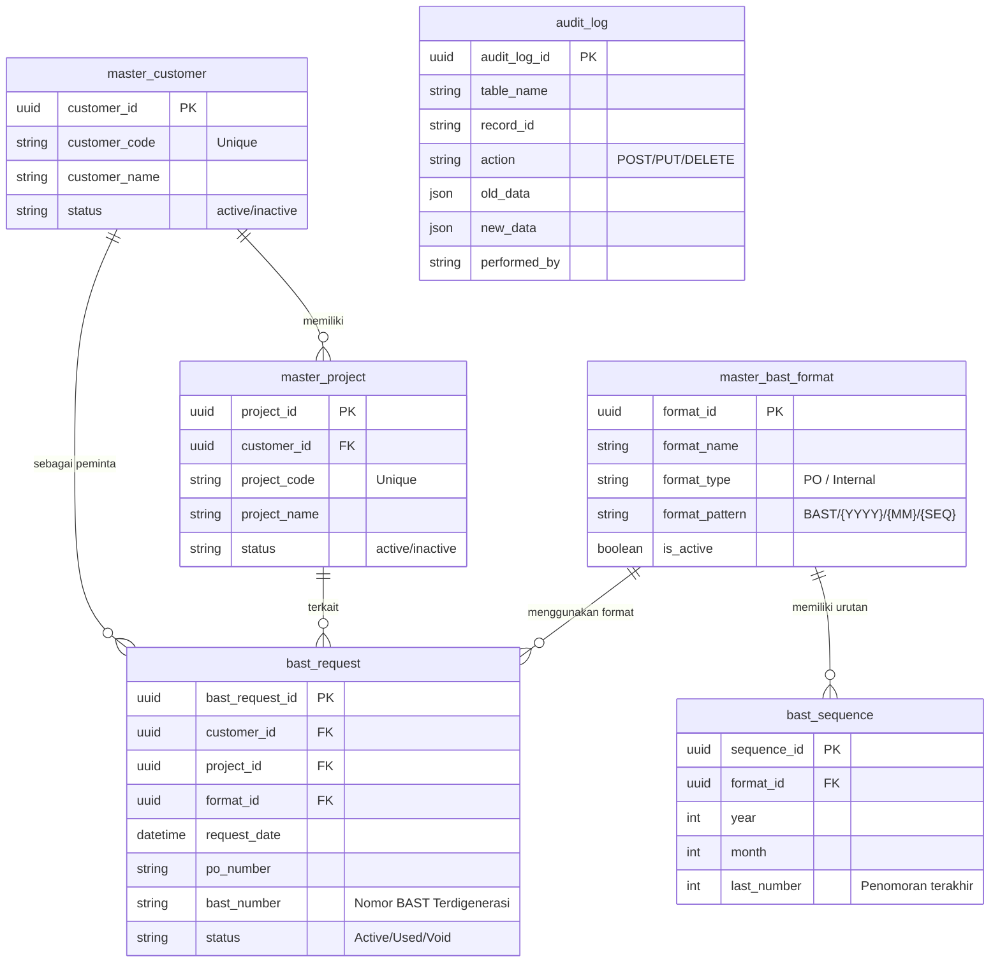

# Panduan Teknis & Arsitektur - BAST Request API

	Dokumen ini adalah panduan teknikal komprehensif untuk membantu Anda memahami struktur kode, pola arsitektur Clean Architecture, dan dasar-dasar Golang yang digunakan dalam proyek **BAST Request API**.

---

## 1. Arsitektur Database & ER Diagram (Entity-Relationship)

Sistem BAST Request ini menggunakan struktur database relasional yang dirancang untuk menjaga integritas data (Master Data) sambil melacak transaksi (Request BAST) dan perubahan data (Audit Log). Saat ini, aplikasi menggunakan **SQLite** secara bawaan, namun dapat dikonfigurasi menggunakan PostgreSQL.

### Entity-Relationship Diagram (ERD)
Berikut adalah visualisasi hubungan antar tabel dalam database:



### Penjelasan Tabel Database:

1. **`master_customer` & `master_project`**: Adalah Data Master. Setiap *Project* harus terkait ke salah satu *Customer*.
2. **`master_bast_format`**: Mendefinisikan pola (pattern) pembentukan nomor. Contoh: `BAST/PO/{YYYY}/{MM}/{SEQ}`.
3. **`bast_sequence`**: Tabel pelacakan (tracker) khusus yang mencatat *last number* (nomor urut terakhir) berdasarkan `format_id`, Bulan, dan Tahun. Sistem mengecek tabel ini setiap kali membuat *Request* BAST baru untuk mengetahui nomor urut berikutnya tanpa bentrok (Race Condition).
4. **`bast_request`**: Adalah tabel Transaksional inti. Di sinilah permintaan penomoran BAST disimpan. Terhubung ke *Customer*, *Project*, dan *Format* yang dipakai.
5. **`audit_log`**: Digunakan untuk melacak siapa (performed_by) melakukan apa (action) di tabel apa (table_name), beserta rekaman datanya sebelum dan sesudah diganti (old_data & new_data).

---

## 2. Dasar-Dasar Golang untuk Pemula

Sebelum masuk ke arsitektur, ada beberapa konsep kunci di Go yang wajib dipahami:

### a. Struktur Data (Structs)
Go tidak memiliki "Class" seperti di Java atau PHP. Sebagai gantinya, Go menggunakan `struct` untuk mendefinisikan objek.
```go
type Customer struct {
    CustomerID   string
    CustomerName string
}
```

### b. Pointer (`*` dan `&`)
- `*` (asterisk) digunakan untuk mendeklarasikan *pointer* (variabel yang menyimpan alamat memori).
- `&` (ampersand) digunakan untuk mendapatkan alamat memori dari sebuah variabel.

Dalam proyek ini, Anda akan sering melihat *pointer* digunakan pada *parameter* fungsi agar kita memodifikasi objek aslinya (bukan salinannya) dan lebih hemat memori:
```go
// Method ini memiliki 'receiver' berupa pointer (*Customer)
func (c *Customer) SetName(name string) {
    c.CustomerName = name // Nilai aslinya akan berubah
}
```

### c. Penanganan Error (Error Handling)
Go tidak menggunakan `try-catch`. Fungsi di Go biasanya mengembalikan dua nilai: hasil dan error. Anda harus selalu mengecek error secara eksplisit.
```go
user, err := GetUserByID(1)
if err != nil {
    // Tangani error di sini, misalnya return response 500/404
    return err
}
```

### d. Aturan Huruf Kapital (Exported vs Unexported)
- **Huruf Kapital Awal** (`GetCustomer`): Berarti fungsi/variabel bersifat **Public** (dapat di-import dan dipakai di file/package lain).
- **Huruf Kecil Awal** (`getCustomer`): Berarti fungsi/variabel bersifat **Private** (hanya bisa dipakai di dalam file/package tersebut saja).

---

## 3. Struktur Folder (Clean Architecture)

Aplikasi ini menggunakan pola **Clean Architecture** (berbasis 3-layer architecture). Tujuannya agar kode mudah dites, dimaintenance, dan tidak saling tumpang tindih.

```text
BAST Request/
├── cmd/
│   └── api/
│       └── main.go                 # Entry point aplikasi
├── docs/                           # Dokumentasi (Swagger & panduan ini)
├── internal/
│   ├── config/                     # Konfigurasi koneksi DB, inisialisasi, & seed
│   ├── models/                     # Deklarasi struktur database (GORM Entities)
│   ├── repositories/               # Kumpulan query database (GORM)
│   ├── services/                   # Logika bisnis aplikasi
│   ├── handlers/                   # Penerima request HTTP (Controllers)
│   └── routes/                     # Pendaftaran URL endpoint
```

### Alur Kerja (Workflow) Data:
`Client Request` ➡️ `Routes` ➡️ `Handler` ➡️ `Service` ➡️ `Repository` ➡️ `Database`

---

## 4. Penjelasan Masing-Masing Layer

### A. Models (`internal/models/`)
Ini adalah representasi tabel database Anda. Kita menggunakan anotasi *(struct tags)* dari GORM untuk menentukan tipe kolom, primary key, dll.

```go
type Project struct {
    // gorm:"type:uuid;primary_key" memberitahu GORM bahwa ini adalah UUID & Primary Key
    ProjectID   uuid.UUID `gorm:"type:uuid;primary_key"`
    ProjectCode string    `gorm:"type:varchar(50);not null"`
}

// Hooks: Fungsi ini akan otomatis dipanggil GORM tepat SEBELUM data di-insert
func (p *Project) BeforeCreate(tx *gorm.DB) (err error) {
    if p.ProjectID == uuid.Nil {
        p.ProjectID = uuid.New() // Generate UUID otomatis
    }
    return
}
```

### B. Repositories (`internal/repositories/`)
Hanya layer ini yang boleh berinteraksi dengan database.
```go
type ProjectRepository struct {
    db *gorm.DB
}

// Dependency Injection: Menerima koneksi database dari luar
func NewProjectRepository(db *gorm.DB) *ProjectRepository {
    return &ProjectRepository{db: db}
}

func (r *ProjectRepository) Create(project *models.Project) error {
    // r.db.Create() adalah fungsi bawaan GORM untuk insert data
    return r.db.Create(project).Error
}
```

### C. Services (`internal/services/`)
Tempat untuk logika bisnis (misal: validasi kustom, hitungan matematika, pembuatan urutan nomor BAST). Service memanggil Repository, bukan Database secara langsung.

```go
func (s *ProjectService) CreateProject(project *models.Project) error {
    if project.ProjectName == "" {
        return errors.New("nama project tidak boleh kosong")
    }
    return s.repo.Create(project)
}
```

### D. Handlers (`internal/handlers/`)
Menerima request HTTP dari user, membaca data (JSON/Query), dan memanggil Service. Di sinilah **Gin Framework** bekerja penuh.

```go
func (h *ProjectHandler) CreateProject(c *gin.Context) {
    var input models.Project
    
    // 1. Membaca JSON Body dari Request dan memasukkannya ke variabel 'input'
    if err := c.ShouldBindJSON(&input); err != nil {
        c.JSON(http.StatusBadRequest, gin.H{"error": err.Error()})
        return
    }

    // 2. Memanggil Business Logic (Service)
    if err := h.service.CreateProject(&input); err != nil {
        c.JSON(http.StatusInternalServerError, gin.H{"error": err.Error()})
        return
    }

    // 3. Mengembalikan Response (JSON)
    c.JSON(http.StatusCreated, input)
}
```

**Membaca Parameter Lain di Gin:**
- **Path Param** (`/projects/:id`): Gunakan `c.Param("id")`
- **Query Param** (`/projects?status=active`): Gunakan `c.Query("status")`

---

## 5. Routing dengan Gin Framework

File `internal/routes/routes.go` bertugas memetakan URL spesifik ke *Handler* yang tepat.

```go
// r adalah instance dari Gin Engine
func SetupRoutes(r *gin.Engine, db *gorm.DB) {
    // 1. Inisialisasi layer (Dependency Injection)
    customerRepo := repositories.NewCustomerRepository(db)
    customerService := services.NewCustomerService(customerRepo)
    customerHandler := handlers.NewCustomerHandler(customerService)

    // 2. Mengelompokkan API dengan awalan "/api"
    api := r.Group("/api")
    {
        // 3. Mendaftarkan method HTTP
        api.GET("/customers", customerHandler.GetAllCustomers)
        api.POST("/customers", customerHandler.CreateCustomer)
    }
}
```

---

## 6. Dokumentasi API (Swagger)

Aplikasi ini menggunakan **Swaggo** untuk membuat dokumentasi Swagger otomatis dari baris komentar di atas fungsi Handler.

**Contoh Anotasi:**
```go
// CreateCustomer godoc                         -> Nama fungsi untuk Swagger
// @Summary Create a new customer               -> Judul endpoint
// @Description Add a new customer to master    -> Deskripsi lengkap
// @Tags customers                              -> Grup kategori di Swagger UI
// @Accept json                                 -> Format input yang diterima
// @Produce json                                -> Format output yang dikembalikan
// @Param customer body models.Customer true "Customer Data" -> Body request
// @Success 201 {object} models.Customer        -> Model response jika sukses
// @Router /customers [post]                    -> URL dan Method (wajib)
func (h *CustomerHandler) CreateCustomer(c *gin.Context) { ... }
```

**Cara Mengupdate Swagger:**
Setiap kali Anda merubah komentar anotasi atau menambahkan Handler baru, Anda WAJIB menjalankan perintah ini di terminal root proyek Anda:
```bash
swag init -g cmd/api/main.go --parseDependency --parseInternal
```
*(Catatan: Anda harus memiliki program swag terinstal, bisa menggunakan perintah `go install github.com/swaggo/swag/cmd/swag@latest`)*

---

## 7. Latihan Praktek: Menambahkan Tabel Baru

Jika Anda ingin berlatih, cobalah menambahkan sistem `User` dengan urutan sebagai berikut:
1. **Model:** Buat `internal/models/user.go` (Struct `User`).
2. **Migration:** Update `internal/config/database.go` -> `AutoMigrate(&models.User{})`.
3. **Repository:** Buat `internal/repositories/user_repository.go` -> implementasikan `FindAll` dan `Create`.
4. **Service:** Buat `internal/services/user_service.go` -> implementasikan fungsi-fungsi bisnis untuk memanggil repository.
5. **Handler:** Buat `internal/handlers/user_handler.go` -> implementasikan fungsi Gin `(*gin.Context)` untuk `GetAllUsers` dan `CreateUser` lengkap dengan Swagger Anotasi.
6. **Routes:** Buka `internal/routes/routes.go` -> Daftarkan dan inisialisasi layer-layer User.
7. **Jalankan Terminal:** Ketik `swag init ...` dan restart server (`go run ./cmd/api/main.go`). Buka http://localhost:8080/swagger/index.html untuk melihat hasilnya!
