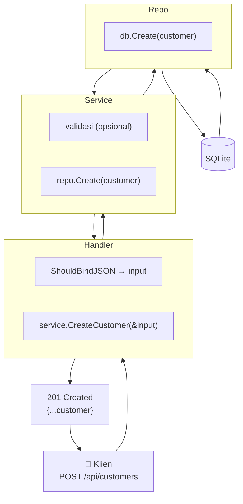

# Step 4: Operasi Master Data (CRUD)

> Seri Tutorial · **Step 4 dari 8**

Kita sudah punya database (Step 2) dan satpam autentikasi (Step 3). Sekarang mari membedah bagaimana operasi **Create-Read-Update-Delete (CRUD)** dilakukan terhadap master data: `Customer`, `Project`, dan `BastFormat`. Di sinilah pola **Repository → Service → Handler** benar-benar terlihat aksinya.

---

## 1. Pola Berantai: Repo → Service → Handler

Ingat [Clean Architecture](../architecture/clean-architecture.md). Untuk operasi CRUD apa pun, alurnya selalu sama:

```text
Handler (HTTP) → Service (Logika) → Repository (SQL) → Database
```

Mari kita bedah satu contoh lengkap: **Customer**. Dua lainnya (`Project`, `BastFormat`) strukturnya nyaris identik.

---

## 2. Repository — Penerjemah ke SQL

File: [`internal/repositories/customer_repository.go`](../../internal/repositories/customer_repository.go)

```go
type CustomerRepository struct {
	db *gorm.DB
}

func NewCustomerRepository(db *gorm.DB) *CustomerRepository {
	return &CustomerRepository{db: db}
}
```
Konstruktor menerima koneksi `db` (dependency injection).

### Method-method CRUD

#### (A) FindAll — dengan filter dinamis
```go
func (r *CustomerRepository) FindAll(status string, name string) ([]models.Customer, error) {
	var customers []models.Customer
	query := r.db.Model(&models.Customer{})

	if status != "" {
		query = query.Where("status = ?", status)          // filter status
	}
	if name != "" {
		query = query.Where("customer_name ILIKE ?", "%"+name+"%")  // filter nama (fuzzy)
	}

	err := query.Find(&customers).Error
	return customers, err
}
```

**Pola penting:** membangun query **bertahap** dengan menggabungkan `Where(...)`. Filter hanya ditambahkan jika parameter tidak kosong. Hasilnya: query fleksibel tanpa menulis SQL manual.

> ⚠️ `ILIKE` adalah operator **case-insensitive** milik PostgreSQL. Di SQLite, `ILIKE` sebenarnya tidak dikenal (SQLite `LIKE` sudah case-insensitive). Ini salah satu hal yang harus disesuaikan jika pindah DB.

#### (B) FindByID
```go
func (r *CustomerRepository) FindByID(id string) (models.Customer, error) {
	var customer models.Customer
	err := r.db.First(&customer, "customer_id = ?", id).Error
	return customer, err
}
```
`First` mengambil 1 baris. Tanda tanya `?` = **parameter binding** (mencegah SQL injection — jangan pernah string concat!).

#### (C) Create
```go
func (r *CustomerRepository) Create(customer *models.Customer) error {
	return r.db.Create(customer).Error
}
```
Pakai pointer `*models.Customer` agar perubahan (mis. UUID yang diisi hook) terlihat di pemanggil.

#### (D) Update
```go
func (r *CustomerRepository) Update(customer *models.Customer) error {
	return r.db.Save(customer).Error
}
```
`Save` menyimpan **semua field** struct. Berbeda dari `Update` yang hanya field tertentu.

#### (E) Delete — soft delete versi custom
```go
func (r *CustomerRepository) Delete(id string) error {
	return r.db.Model(&models.Customer{}).
		Where("customer_id = ?", id).
		Update("status", "inactive").Error
}
```
Menarik: alih-alih `db.Delete()` (soft delete GORM), kode ini **mengubah status jadi "inactive"**. Data tetap ada, hanya ditandai non-aktif.

---

## 3. Service — Mandor Logika Bisnis

File: [`internal/services/customer_service.go`](../../internal/services/customer_service.go)

```go
type CustomerService struct {
	repo *repositories.CustomerRepository
}

func NewCustomerService(repo *repositories.CustomerRepository) *CustomerService {
	return &CustomerService{repo: repo}
}
```

### Method Get — sekadar meneruskan
```go
func (s *CustomerService) GetAllCustomers(status string, name string) ([]models.Customer, error) {
	return s.repo.FindAll(status, name)
}
```
Untuk operasi sederhana, service mungkin hanya "jembatan" ke repository. Tapi di sinilah tempat menambah **validasi bisnis** kelak.

### Method Update — memilih field yang diubah
```go
func (s *CustomerService) UpdateCustomer(id string, input *models.Customer) (models.Customer, error) {
	// (1) Ambil data lama
	customer, err := s.repo.FindByID(id)
	if err != nil {
		return customer, err
	}

	// (2) Timpa hanya field yang relevan
	customer.CustomerName = input.CustomerName
	customer.CustomerCode = input.CustomerCode
	customer.Status = input.Status

	// (3) Simpan
	err = s.repo.Update(&customer)
	return customer, err
}
```

**Pola ini penting:** ambil record existing → timpa field tertentu → simpan. Mencegah *mass-assignment* tak sengaja (mis. client mencoba set `CreatedAt`).

---

## 4. Handler — Membaca Internet (HTTP/JSON)

File: [`internal/handlers/customer_handler.go`](../../internal/handlers/customer_handler.go)

### Create — pola klasik 3 langkah
```go
// CreateCustomer godoc
// @Summary Create a new customer
// @Description Add a new customer to the master data
// @Tags customers
// @Accept json
// @Produce json
// @Param customer body models.Customer true "Customer Data"
// @Success 201 {object} models.Customer
// @Router /customers [post]
func (h *CustomerHandler) CreateCustomer(c *gin.Context) {
	var input models.Customer

	// (1) Baca JSON body → tuangkan ke struct input
	if err := c.ShouldBindJSON(&input); err != nil {
		c.JSON(http.StatusBadRequest, gin.H{"error": err.Error()})
		return
	}

	// (2) Serahkan ke service
	if err := h.service.CreateCustomer(&input); err != nil {
		c.JSON(http.StatusInternalServerError, gin.H{"error": err.Error()})
		return
	}

	// (3) Balas JSON
	c.JSON(http.StatusCreated, input)
}
```

Komentar `// @Summary` dst itu **anotasi Swagger** — dibahas di [Step 8](step-08-swagger-documentation.md).

### GetAll — baca query param
```go
func (h *CustomerHandler) GetAllCustomers(c *gin.Context) {
	status := c.Query("status")
	name := c.Query("nama")   // ← parameter URL-nya "nama", dipetakan ke name

	customers, err := h.service.GetAllCustomers(status, name)
	if err != nil {
		c.JSON(http.StatusInternalServerError, gin.H{"error": err.Error()})
		return
	}
	c.JSON(http.StatusOK, customers)
}
```

**Tips membaca input di Gin:**
| Jenis | Contoh URL | Cara ambil |
|---|---|---|
| **Path param** | `/customers/:id` | `c.Param("id")` |
| **Query param** | `/customers?status=active` | `c.Query("status")` |
| **Body JSON** | `{...}` | `c.ShouldBindJSON(&input)` |

---

## 5. Project & BastFormat — Pola yang Sama

File:
- [`internal/repositories/project_repository.go`](../../internal/repositories/project_repository.go)
- [`internal/repositories/bast_format_repository.go`](../../internal/repositories/bast_format_repository.go)
- [`internal/services/project_service.go`](../../internal/services/project_service.go)
- [`internal/services/bast_format_service.go`](../../internal/services/bast_format_service.go)
- handler masing-masing

Strukturnya nyaris identik dengan Customer. Beberapa perbedaan kecil:

### Project — ada Preload
```go
// internal/repositories/project_repository.go:18
query := r.db.Preload("Customer")   // sertakan data customer terkait
```
Karena Project punya FK ke Customer, kita preload agar respons JSON nested.

### BastFormat — field boolean
```go
IsActive bool `gorm:"default:true"`
```
Delete pada format = set `is_active = false` (soft-deactivate), bukan hapus permanen.

---

## 6. Diagram Alur CRUD



---

## 7. Uji Coba CRUD Lengkap

Asumsi: Anda sudah login & punya token.

### Create
```bash
curl -X POST http://localhost:8080/api/customers \
  -H "Authorization: Bearer <TOKEN>" \
  -H "Content-Type: application/json" \
  -d '{"customer_code":"CUST-003","customer_name":"PT. Sukses Jaya","status":"active"}'
```

### Read (dengan filter)
```bash
# Semua
curl -H "Authorization: Bearer <TOKEN>" "http://localhost:8080/api/customers"
# Filter status
curl -H "Authorization: Bearer <TOKEN>" "http://localhost:8080/api/customers?status=active"
# Filter nama (fuzzy)
curl -H "Authorization: Bearer <TOKEN>" "http://localhost:8080/api/customers?nama=Sukses"
```

### Update
```bash
curl -X PUT http://localhost:8080/api/customers/<ID> \
  -H "Authorization: Bearer <TOKEN>" \
  -H "Content-Type: application/json" \
  -d '{"customer_code":"CUST-003","customer_name":"PT. Sukses Jaya Abadi","status":"active"}'
```

### Delete
```bash
curl -X DELETE http://localhost:8080/api/customers/<ID> \
  -H "Authorization: Bearer <TOKEN>"
```
> ⚠️ Endpoint delete customer dibatasi untuk `superadmin`/`admin` saja — lihat [Step 7](step-07-routing-and-rbac.md).

Detail lengkap parameter & respons di [Referensi Customer](../api-reference/customer-endpoints.md).

---

## ✅ Ringkasan Step 4
- CRUD selalu mengikuti rantai: **Handler → Service → Repository → DB**.
- Repository memakai GORM (`Find`, `First`, `Create`, `Save`, `Update`) dengan **parameter binding** anti SQL-injection.
- Service bisa jadi "jembatan" sederhana atau tempat **validasi bisnis**.
- Handler hanya mengurus HTTP: baca input (path/query/body) → panggil service → balas JSON.
- Beberapa operasi delete di proyek ini adalah **soft-deactivate** (ubah `status`/`is_active`), bukan hapus permanen.

CRUD master data sudah jelas. Tapi jantung sejati aplikasi ini adalah **penomoran BAST otomatis** — yang akan membawa kita ke transaksi database.

---

⬅️ **[Step 3: Autentikasi JWT](step-03-authentication-jwt.md)** · ➡️ **[Step 5: Mesin Penomoran BAST](step-05-bast-numbering-engine.md)**
