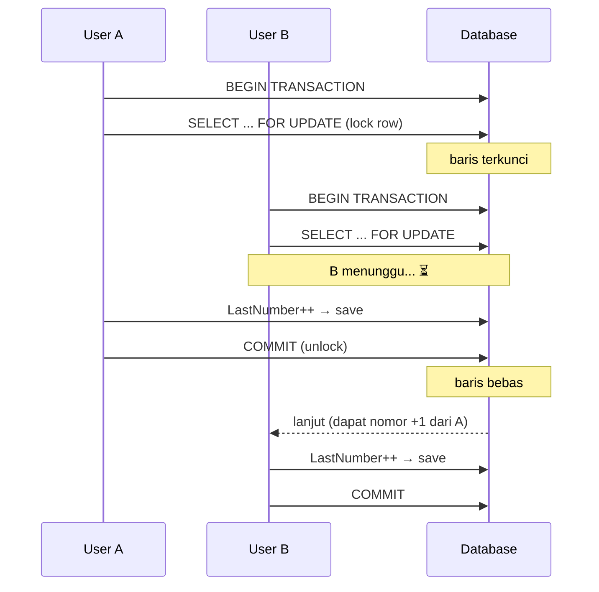

# Step 5: Mesin Penomoran BAST (Core Transaction Logic)

> Seri Tutorial · **Step 5 dari 8**

Inilah **jantung aplikasi**: bagaimana sistem menghasilkan nomor BAST unik, berurutan, dan kebal dari race condition. Membahas kerja sama antara `BastFormat` (pola), `BastSequence` (pelacak nomor), dan `BastRequest` (transaksi), semuanya dalam payung **transaksi database**.

---

## 1. Skenario Masalah

Bayangkan mesin antrian rumah sakit. Jika 2 orang menekan tombol **bersamaan**, mereka **tidak boleh** dapat nomor yang sama. Untuk BAST juga begitu: kalau 2 staff meminta nomor BAST di detik yang sama, masing-masing harus dapat nomor berbeda (mis. `0001` & `0002`), bukan keduanya `0001`.

Masalah ini disebut **race condition**. Solusinya: **transaksi database + row locking**.

---

## 2. Tiga Komponen Utama

| Komponen | Tabel | Tugas |
|---|---|---|
| **BastFormat** | `master_bast_format` | Menyimpan **pola** (template) nomor |
| **BastSequence** | `bast_sequence` | Menyimpan **nomor terakhir** per format+periode |
| **BastRequest** | `bast_request` | Transaksi final yang menyimpan hasil |

---

## 3. BastFormat — Pola Nomor

File: [`internal/models/bast_format.go:10-19`](../../internal/models/bast_format.go)
```go
type BastFormat struct {
	FormatID      uuid.UUID `gorm:"type:uuid;primary_key"`
	FormatName    string    `gorm:"type:varchar(100);not null"`
	FormatType    string    `gorm:"type:varchar(50);not null"`     // PO / Internal
	FormatPattern string    `gorm:"type:varchar(255);not null"`    // pola
	IsActive      bool      `gorm:"default:true"`
	// ... timestamps
}
```

Contoh pola (dari seed):
```
BAST/INT/{YYYY}/{MM}/{SEQ}
```

Placeholder yang diganti saat generate:
| Placeholder | Diganti jadi | Contoh |
|---|---|---|
| `{YYYY}` | Tahun (4 digit) | `2026` |
| `{MM}` | Bulan (2 digit) | `06` |
| `{SEQ}` | Nomor urut (4 digit, di-padding nol) | `0001` |

Hasil: `BAST/INT/2026/06/0001`

---

## 4. BastSequence — Pelacak Nomor

File: [`internal/models/bast_sequence.go`](../../internal/models/bast_sequence.go)

```go
type BastSequence struct {
	SequenceID uuid.UUID  `gorm:"type:uuid;primary_key"`
	FormatID   uuid.UUID  `gorm:"...;uniqueIndex:idx_format_year_month"`
	Format     BastFormat `gorm:"foreignKey:FormatID"`
	Year       int        `gorm:"...;uniqueIndex:idx_format_year_month"`
	Month      int        `gorm:"...;uniqueIndex:idx_format_year_month"`
	LastNumber int        `gorm:"not null;default:0"`
	// ... timestamps
}
```

**Penting:** kombinasi `(FormatID, Year, Month)` bersifat **unik** (index komposit). Artinya tiap format, per bulan, per tahun, hanya ada **satu baris pelacak**.

Logikanya:
- Baris ini menyimpan `last_number` (nomor urut terakhir yang dikeluarkan).
- Setiap kali ada request baru, sistem baca `last_number`, tambah 1, simpan kembali.
- Nomor urut **otomatis reset tiap bulan** karena kombinasi year+month baru = baris baru.

---

## 5. Repository — IncrementAndGet (Atomic!)

File: [`internal/repositories/bast_sequence_repository.go:25-64`](../../internal/repositories/bast_sequence_repository.go)

Inilah inti anti-race-condition:

```go
func (r *BastSequenceRepository) IncrementAndGet(formatID string, year int, month int) (int, error) {
	var seq models.BastSequence

	err := r.db.Transaction(func(tx *gorm.DB) error {
		// (1) LOCK baris agar tidak bisa dibaca-ubah bersamaan
		err := tx.Clauses(clause.Locking{Strength: "UPDATE"}).
			Where("format_id = ? AND year = ? AND month = ?", formatID, year, month).
			First(&seq).Error

		if err != nil {
			if err == gorm.ErrRecordNotFound {
				// Belum ada sequence untuk bulan ini → biar service yang create
				return err
			}
			return err
		}

		// (2) Increment nomor
		seq.LastNumber++

		// (3) Simpan (masih dalam transaksi)
		if err := tx.Save(&seq).Error; err != nil {
			return err
		}
		return nil
	})

	if err != nil {
		return 0, err
	}
	return seq.LastNumber, nil
}
```

### Penjelasan mekanisme penguncian

#### `r.db.Transaction(func(tx *gorm.DB) error {...})`
Membungkus seluruh operasi dalam **satu transaksi**. Artinya:
- Semua berhasil → `COMMIT` (perubahan permanen).
- Ada error → `ROLLBACK` (semua dibatalkan, seolah tak terjadi apa-apa).
- **All-or-nothing.**

#### `clause.Locking{Strength: "UPDATE"}`
Ini menerjemahkan ke SQL `SELECT ... FOR UPDATE` — **mengunci baris** yang dipilih selama transaksi berlangsung. Konsekuensinya:
- Jika user A sedang baca-ubah baris X,
- user B yang mencoba baca baris X **harus menunggu** sampai A selesai (commit/rollback).
- Maka user A & B **mustahil** dapat nomor sama.



---

## 6. Service — Orkestrasi Lengkap

File: [`internal/services/bast_request_service.go:34-73`](../../internal/services/bast_request_service.go)

```go
func (s *BastRequestService) CreateRequest(req *models.BastRequest) error {
	// (1) Ambil format berdasarkan ID
	format, err := s.formatService.GetFormatByID(req.FormatID.String())
	if err != nil {
		return errors.New("invalid format ID")
	}

	// (2) Generate nomor BAST sesuai tipe
	if req.TipeNomor == "Internal" {
		now := time.Now()
		year := now.Year()
		month := int(now.Month())

		// (2a) Ambil nomor urut berikutnya (atomic!)
		nextNum, err := s.seqService.GenerateNextNumber(format.FormatID.String(), year, month)
		if err != nil {
			return fmt.Errorf("failed to generate running number: %v", err)
		}

		// (2b) Ganti placeholder pola
		bastNum := format.FormatPattern
		bastNum = strings.ReplaceAll(bastNum, "{YYYY}", fmt.Sprintf("%04d", year))
		bastNum = strings.ReplaceAll(bastNum, "{MM}", fmt.Sprintf("%02d", month))
		bastNum = strings.ReplaceAll(bastNum, "{SEQ}", fmt.Sprintf("%04d", nextNum))

		req.BastNumber = bastNum
	} else if req.TipeNomor == "PO" {
		// (2c) PO: pakai nomor PO dari client
		if req.PoNumber == "" {
			return errors.New("po_number is required for TipeNomor PO")
		}
		req.BastNumber = req.PoNumber
	} else {
		return errors.New("invalid tipe_nomor, must be Internal or PO")
	}

	// (3) Set status default
	req.Status = "Active"

	// (4) Simpan transaksi
	return s.repo.Create(req)
}
```

### Penjelasan logika

#### Cabang "Internal" (auto-generate)
1. Ambil waktu sekarang → tahun & bulan.
2. Panggil `GenerateNextNumber` (yang memanggil `IncrementAndGet` atomic).
3. Bangun string nomor: ganti `{YYYY}`, `{MM}`, `{SEQ}`.

Fungsi format:
- `fmt.Sprintf("%04d", 1)` → `"0001"` (padding nol jadi 4 digit).
- `fmt.Sprintf("%02d", 6)` → `"06"`.

#### Cabang "PO" (pakai nomor customer)
Tidak generate urut, langsung pakai `po_number` yang dikirim client. Tapi wajib ada — kalau kosong, error.

#### GenerateNextNumber di Service Sequence
File: [`internal/services/bast_sequence_service.go:43-67`](../../internal/services/bast_sequence_service.go)

```go
func (s *BastSequenceService) GenerateNextNumber(formatID string, year int, month int) (int, error) {
	nextNumber, err := s.repo.IncrementAndGet(formatID, year, month)
	if err != nil {
		if err.Error() == "record not found" {
			// Bulan ini belum ada sequence → buat baru dengan last_number = 1
			uid, _ := uuid.Parse(formatID)
			seq := models.BastSequence{
				FormatID:   uid,
				Year:       year,
				Month:      month,
				LastNumber: 1,
			}
			s.repo.Create(&seq)
			return 1, nil
		}
		return 0, err
	}
	return nextNumber, nil
}
```

**Penanganan khusus:** jika sequence untuk bulan ini belum ada (artinya request pertama bulan itu), service membuat baris baru dengan `LastNumber = 1`. Request berikutnya di bulan sama akan masuk cabang increment normal.

---

## 7. Update Status

File: [`internal/services/bast_request_service.go:75-81`](../../internal/services/bast_request_service.go)

```go
func (s *BastRequestService) UpdateStatus(id string, status string) error {
	validStatuses := map[string]bool{"Active": true, "Used": true, "Void": true}
	if !validStatuses[status] {
		return errors.New("invalid status")
	}
	return s.repo.UpdateStatus(id, status)
}
```

Validasi status pakai map — cepat & jelas. Hanya 3 nilai yang diizinkan:
- `Active` → baru dibuat, belum dipakai
- `Used` → nomor sudah dipakai di dokumen resmi
- `Void` → dibatalkan

---

## 8. Repository BastRequest — dengan Preload

File: [`internal/repositories/bast_request_repository.go:16-32`](../../internal/repositories/bast_request_repository.go)

```go
func (r *BastRequestRepository) FindAll(customerID, projectID, status string) ([]models.BastRequest, error) {
	var requests []models.BastRequest
	query := r.db.Preload("Customer").Preload("Project").Preload("Format")

	if customerID != "" {
		query = query.Where("customer_id = ?", customerID)
	}
	if projectID != "" {
		query = query.Where("project_id = ?", projectID)
	}
	if status != "" {
		query = query.Where("status = ?", status)
	}

	err := query.Find(&requests).Error
	return requests, err
}
```

Tiga `Preload` agar respons JSON nested lengkap (data customer + project + format ikut).

---

## 9. Uji Coba Penomoran

Asumsi: sudah punya `customer_id`, `project_id`, `format_id` (dari seed/GET sebelumnya).

### Buat BAST Internal
```bash
curl -X POST http://localhost:8080/api/bast-requests \
  -H "Authorization: Bearer <TOKEN>" \
  -H "Content-Type: application/json" \
  -d '{
    "customer_id":"<ID-CUSTOMER>",
    "project_id":"<ID-PROJECT>",
    "format_id":"<ID-FORMAT-INT>",
    "perihal":"Serah terima server",
    "tipe_nomor":"Internal",
    "requested_by":"Mada"
  }'
```
**Respons:** field `bast_number` akan otomatis terisi, mis. `BAST/INT/2026/06/0001`.

### Buat lagi (urut naik)
Panggil endpoint yang sama lagi → `bast_number` jadi `BAST/INT/2026/06/0002`. Itu kerja sequence!

### Buat BAST PO
```bash
curl -X POST http://localhost:8080/api/bast-requests \
  -H "Authorization: Bearer <TOKEN>" \
  -H "Content-Type: application/json" \
  -d '{
    "customer_id":"<ID-CUSTOMER>",
    "project_id":"<ID-PROJECT>",
    "format_id":"<ID-FORMAT-PO>",
    "perihal":"Serah terima PO-123",
    "tipe_nomor":"PO",
    "po_number":"PO/2026/001",
    "requested_by":"Mada"
  }'
```
Maka `bast_number` = `PO/2026/001`.

> 💡 Untuk eksperimen race condition, jalankan 2 request paralel (mis. dengan tool load testing) dan lihat nomornya tetap unik. Detail eksperimen di [Deep Dive Penomoran](../guides/bast-numbering-deep-dive.md).

---

## ✅ Ringkasan Step 5
- Nomor BAST dibentuk dari **pola** (`BastFormat`) + **nomor urut** (`BastSequence`).
- `BastSequence` punya unique index komposit `(format_id, year, month)` → otomatis reset tiap bulan.
- Anti race-condition: `r.db.Transaction(...)` + `clause.Locking{Strength:"UPDATE"}`.
- Dua cabang: `Internal` (auto-generate) vs `PO` (pakai nomor customer).
- Validasi status via map: hanya `Active`, `Used`, `Void`.

Penomoran sudah beres. Tapi bagaimana kita tahu **siapa mengubah apa, kapan**? Itu tugas audit log.

---

⬅️ **[Step 4: Master Data CRUD](step-04-master-data-crud.md)** · ➡️ **[Step 6: Audit Log](step-06-audit-log.md)**

> 🤿 Mau lebih dalam soal locking & reset sequence? Lihat [Deep Dive Penomoran BAST](../guides/bast-numbering-deep-dive.md).
