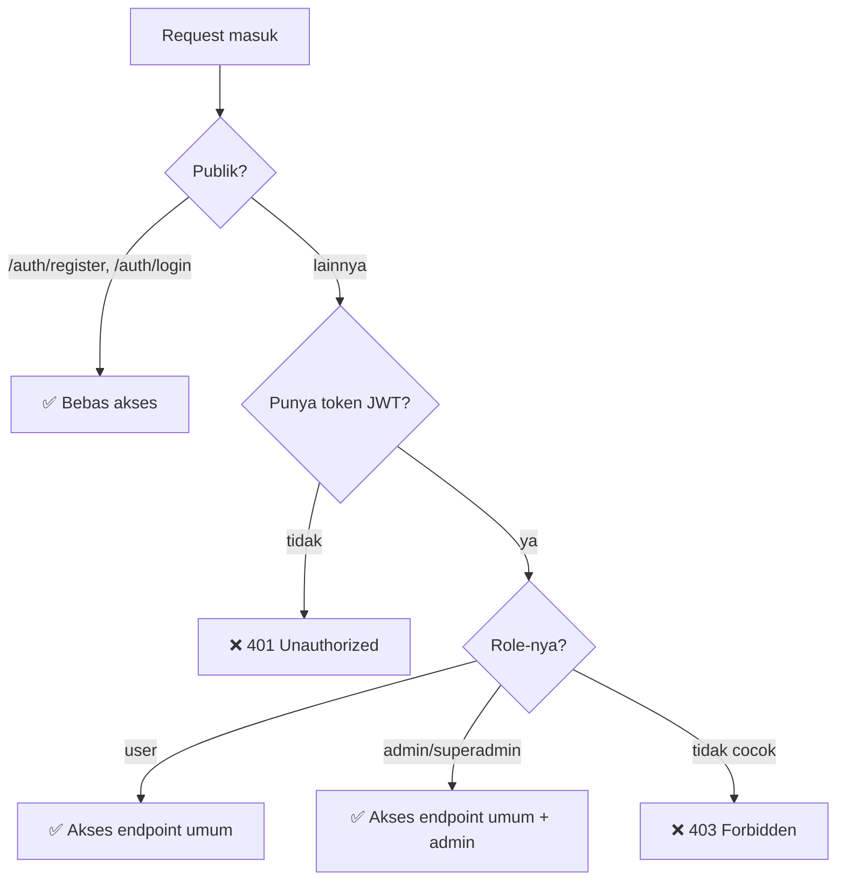

# Step 7: Routing & Role-Based Access Control (RBAC)

> Seri Tutorial · **Step 7 dari 8**

Kita sudah punya semua komponen: model, repository, service, handler, middleware. Tapi bagaimana semuanya **disambungkan** jadi API yang bisa diakses? Itu tugas file `routes.go`. Di sini juga terjadi **Dependency Injection** dan pengaturan **hak akses berbasis role (RBAC)**.

---

## 1. Peran File `routes.go`

File: [`internal/routes/routes.go`](../../internal/routes/routes.go)

Tugas utamanya:
1. **Menyusun dependency** dari bawah ke atas: Repository → Service → Handler.
2. **Mendaftarkan URL** ke Handler yang tepat.
3. **Menerapkan middleware** (JWT + Role) sesuai kelompok rute.
4. **Meng-host Swagger UI**.

---

## 2. Dependency Injection — Susun dari Bawah

Baris-baris awal `SetupRoutes`:

```go
func SetupRoutes(r *gin.Engine, db *gorm.DB) {
	// Customer
	customerRepo := repositories.NewCustomerRepository(db)
	customerService := services.NewCustomerService(customerRepo)
	customerHandler := handlers.NewCustomerHandler(customerService)

	// Project
	projectRepo := repositories.NewProjectRepository(db)
	projectService := services.NewProjectService(projectRepo)
	projectHandler := handlers.NewProjectHandler(projectService)

	// Format, Sequence, Request, Audit, Auth...
	// (pola sama)
}
```

### Mengapa begini?
Setiap layer menerima dependensi dari **luar** (parameter). Ini inti **Dependency Injection**:
- `NewCustomerRepository(db)` → repo butuh koneksi DB.
- `NewCustomerService(customerRepo)` → service butuh repo.
- `NewCustomerHandler(customerService)` → handler butuh service.

Hasilnya: handler siap pakai, dan setiap layer bisa **di-mock** saat testing.

### Dependency lintas-service
Ada kasus menarik di BastRequest:
```go
requestService := services.NewBastRequestService(requestRepo, formatService, seqService)
```
Service `BastRequest` **butuh 2 service lain** (`formatService` & `seqService`) — bukan repo-nya sendiri saja. Karena saat create request, ia butuh ambil format & generate nomor urut. Ini contoh orkestrasi antar-service.

---

## 3. Struktur Grup Rute

Inilah inti RBAC. Rute dikelompokkan bertingkat:

```go
api := r.Group("/api")
{
	// (A) ENDPOINT PUBLIK — tanpa token
	api.POST("/auth/register", authHandler.Register)
	api.POST("/auth/login", authHandler.Login)

	// (B) ENDPOINT TERLINDUNGI — butuh token valid
	protected := api.Group("/")
	protected.Use(middlewares.RequireAuth())
	{
		// Bisa diakses siapa pun yang punya token
		protected.GET("/projects", projectHandler.GetAllProjects)

		// (C) KHUSUS ADMIN — butuh role superadmin/admin
		adminOnly := protected.Group("/")
		adminOnly.Use(middlewares.RequireRole("superadmin", "admin"))
		{
			adminOnly.POST("/projects", projectHandler.CreateProject)
			adminOnly.DELETE("/customers/:id", customerHandler.DeleteCustomer)
		}

		// Endpoint master & transaksi (butuh token, semua role)
		protected.GET("/customers", customerHandler.GetAllCustomers)
		protected.GET("/customers/:id", customerHandler.GetCustomerByID)
		protected.POST("/customers", customerHandler.CreateCustomer)
		protected.PUT("/customers/:id", customerHandler.UpdateCustomer)

		protected.GET("/projects/:id", projectHandler.GetProjectByID)
		// ... dst

		protected.GET("/bast-requests", requestHandler.GetAllRequests)
		// ... dst

		protected.GET("/audit-logs", auditHandler.GetAllAuditLogs)
		// ... dst
	}
}

// Swagger UI (publik)
r.GET("/swagger/*any", ginSwagger.WrapHandler(swaggerFiles.Handler))
```

### Tiga tingkat akses



| Tingkat | Syarat | Contoh Endpoint |
|---|---|---|
| **Publik** | Tanpa syarat | `/auth/register`, `/auth/login`, `/ping`, `/swagger/*` |
| **Terlindungi** | Token JWT valid | `GET /customers`, `POST /bast-requests`, `GET /audit-logs` |
| **Admin-only** | Token + role `admin`/`superadmin` | `POST /projects`, `DELETE /customers/:id` |

---

## 4. Cara Grup Bekerja di Gin

```go
protected := api.Group("/")
protected.Use(middlewares.RequireAuth())
```

`Group("/")` membuat sub-router. `Use(...)` memasang middleware yang **berlaku untuk semua rute di dalam grup ini** (dan sub-grupnya).

Saat request masuk ke `GET /api/customers`:
1. Gin cocokkan rute → masuk grup `protected`.
2. Middleware `RequireAuth` jalan dulu → cek token.
3. Jika valid → `c.Next()` → handler `GetAllCustomers` jalan.
4. Jika invalid → `c.AbortWithStatusJSON(401)` → request berhenti, handler tak tercapai.

### Sub-grup `adminOnly`
```go
adminOnly := protected.Group("/")
adminOnly.Use(middlewares.RequireRole("superadmin", "admin"))
```
Karena `adminOnly` adalah sub-grup dari `protected`, request ke `/api/projects` (POST) harus lewati **dua** middleware: `RequireAuth` dulu, baru `RequireRole`.

---

## 5. Import Penting: Swagger

```go
import (
	_ "bast-request/docs"   // blank import!
	swaggerFiles "github.com/swaggo/files"
	ginSwagger "github.com/swaggo/gin-swagger"
)
```

Perhatikan underscore `_` di `"bast-request/docs"`. Itu **blank import** — kita import package-nya **tanpa memakai simbol apa pun**. Tujuannya: menjalankan `init()` di `docs.go` yang mendaftarkan spesifikasi Swagger ke memori. Tanpa ini, Swagger UI akan kosong.

---

## 6. Pemetaan Endpoint Lengkap

Total ada **±24 endpoint** terdaftar. Ringkasannya:

| Grup | Method | Path | Handler |
|---|---|---|---|
| Publik | POST | `/api/auth/register` | `authHandler.Register` |
| Publik | POST | `/api/auth/login` | `authHandler.Login` |
| Protected | GET | `/api/projects` | `projectHandler.GetAllProjects` |
| Admin | POST | `/api/projects` | `projectHandler.CreateProject` |
| Admin | DELETE | `/api/customers/:id` | `customerHandler.DeleteCustomer` |
| Protected | GET/POST | `/api/customers[/:id]` | customerHandler.* |
| Protected | GET/PUT/DELETE | `/api/projects/:id` | projectHandler.* |
| Protected | CRUD | `/api/bast-formats[/:id]` | formatHandler.* |
| Protected | GET/POST | `/api/bast-sequences[/reset]` | seqHandler.* |
| Protected | GET/POST/PATCH | `/api/bast-requests[/:id/...]` | requestHandler.* |
| Protected | GET | `/api/audit-logs[/:id]` | auditHandler.* |
| Publik | GET | `/swagger/*any` | ginSwagger |

Detail tiap endpoint (parameter, body, respons) ada di [folder api-reference/](../api-reference/).

---

## 7. Middleware Rekap (dari Step 3)

Ingat kedua middleware di [`internal/middlewares/auth_middleware.go`](../../internal/middlewares/auth_middleware.go):

### `RequireAuth()`
- Cek header `Authorization: Bearer <token>`.
- Validasi token via `utils.ValidateToken`.
- Simpan `userID` & `userRole` ke Gin Context.
- Tolak (401) jika tak ada/invalid.

### `RequireRole(allowedRoles...)`
- Ambil `userRole` dari context (yang di-set `RequireAuth`).
- Cek apakah role ada di daftar yang diizinkan.
- Tolak (403) jika tidak.

Keduanya bekerja **berurutan**: auth dulu, baru role.

---

## 8. Uji Coba RBAC

### Skenario 1: Akses tanpa token → ditolak
```bash
curl http://localhost:8080/api/customers
```
**Respons:** `{"error":"Authorization header is required"}` (401).

### Skenario 2: Role `user` coba akses endpoint admin → ditolak
Register user dengan role "user", login, lalu:
```bash
curl -X DELETE http://localhost:8080/api/customers/<ID> \
  -H "Authorization: Bearer <TOKEN-USER>"
```
**Respons:** `{"error":"Anda tidak memiliki akses (Forbidden)"}` (403).

### Skenario 3: Role `admin` → diizinkan
Register user role "admin", login, lalu hapus → sukses (200).

---

## 9. Catatan Desain

### Role belum di-enforce saat Register?
Di [`internal/services/auth_service.go`](../../internal/services/auth_service.go), `Register` menerima `role` dari request body apa adanya. Artinya, **siapa pun bisa register sebagai superadmin** kalau tahu nama rolenya. Ini **celah keamanan** yang sebaiknya diperbaiki di produksi (mis. register publik hanya boleh role `user`; role lebih tinggi via admin panel).

> 💡 **Ide pengembangan:** validasi role saat register — batasi role yang bisa dipilih klien publik.

### Beberapa endpoint mungkin perlu pembatasan lebih ketat
Saat ini mis. `POST /customers` bisa diakses semua role ber-token. Mungkin sebaiknya dibatasi admin saja tergantung kebutuhan bisnis.

---

## ✅ Ringkasan Step 7
- `routes.go` adalah **pusat penyambungan**: DI + routing + RBAC.
- Dependency Injection menyusun Repository → Service → Handler dari bawah ke atas.
- Rute dikelompokkan 3 tingkat: **Publik → Protected (token) → Admin (token + role)**.
- Gin `Group` + `Use` menerapkan middleware secara hierarkis.
- Blank import `_ "bast-request/docs"` mendaftarkan spesifikasi Swagger ke memori.
- Ada celah: register publik masih bisa pilih role apa pun — perlu diperketat di produksi.

Semua endpoint sudah hidup & terlindungi. Langkah terakhir: membuat **dokumentasi Swagger** yang otomatis dari kode.

---

⬅️ **[Step 6: Audit Log](step-06-audit-log.md)** · ➡️ **[Step 8: Dokumentasi Swagger](step-08-swagger-documentation.md)**

> 📖 Butuh daftar lengkap semua endpoint? Lihat [Referensi API](../api-reference/README.md).
