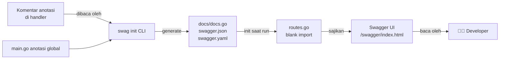

# Step 8: Dokumentasi API (Swagger)

> Seri Tutorial · **Step 8 dari 8** (TAMAT)

Langkah terakhir: memastikan dokumentasi API **ter-generate otomatis** dari kode, sehingga frontend developer atau klien bisa membaca skema API tanpa menebak-nebak. Kita memakai **swaggo/swag** yang membaca komentar khusus di kode Go → menghasilkan spesifikasi OpenAPI → ditampilkan sebagai Swagger UI interaktif.

---

## 1. Mengapa Swagger?

Tanpa dokumentasi yang baik, klien API harus menebak:
- URL apa yang dipanggil?
- Body JSON seperti apa?
- Responsnya bentuknya gimana?

**Swagger (OpenAPI)** menyelesaikan ini dengan UI interaktif: daftar endpoint, schema, dan tombol **"Try it out"** untuk test langsung. Yang istimewa: di proyek ini, dokumentasinya **ter-generate dari kode** — jadi selalu sinkron dengan implementasi.

---

## 2. Anotasi di `main.go` (Identitas Global)

File: [`cmd/api/main.go:10-17`](../../cmd/api/main.go)

```go
// @title BAST Request API
// @version 1.0
// @description This is the API server for BAST Request System.
// @host localhost:8080
// @BasePath /api
// @securityDefinitions.apikey BearerAuth
// @in header
// @name Authorization
func main() { ... }
```

| Anotasi | Arti |
|---|---|
| `@title` | Judul API |
| `@version` | Versi |
| `@host` | Host server (untuk "Try it out") |
| `@BasePath` | Prefix semua endpoint (mis. `/api`) |
| `@securityDefinitions.apikey BearerAuth` | Mendefinisikan skema keamanan bernama `BearerAuth` |
| `@in header` / `@name Authorization` | Token dikirim via header `Authorization` |

Deklarasi `BearerAuth` ini penting: memunculkan ikon 🔒 **Authorize** di Swagger UI, sehingga Anda bisa input token sekali untuk semua endpoint.

---

## 3. Anotasi per Handler

Setiap fungsi handler punya blok komentar anotasi. Contoh di [`internal/handlers/customer_handler.go:60-70`](../../internal/handlers/customer_handler.go):

```go
// CreateCustomer godoc
// @Summary Create a new customer
// @Description Add a new customer to the master data
// @Tags customers
// @Accept json
// @Produce json
// @Param customer body models.Customer true "Customer Data"
// @Success 201 {object} models.Customer
// @Failure 400 {object} map[string]interface{}
// @Failure 500 {object} map[string]interface{}
// @Router /customers [post]
func (h *CustomerHandler) CreateCustomer(c *gin.Context) { ... }
```

### Daftar tag anotasi

| Tag | Contoh | Fungsi |
|---|---|---|
| `@Summary` | "Create a new customer" | Judul singkat endpoint |
| `@Description` | "Add a new customer..." | Penjelasan panjang |
| `@Tags` | `customers` | Pengelompokan di UI (jadi section "customers") |
| `@Accept` | `json` | Format input yang diterima |
| `@Produce` | `json` | Format output |
| `@Param` | `customer body models.Customer true "..."` | Parameter: nama, jenis (body/query/path), tipe, wajib?, deskripsi |
| `@Success` | `201 {object} models.Customer` | Respons sukses: kode, tipe |
| `@Failure` | `400 {object} map[string]interface{}` | Respons error |
| `@Router` | `/customers [post]` | Path + method HTTP (WAJIB agar muncul) |
| `@Security` | `BearerAuth` | Tandai endpoint butuh token |

### Bentuk `@Param`
```
@Param <nama> <jenis> <tipe> <wajib?> "<deskripsi>"
```
- `<jenis>`: `body`, `query`, `path`, `header`, `formData`
- Contoh query: `@Param status query string false "Status filter"` (`false` = opsional)
- Contoh path: `@Param id path string true "Customer ID"`

---

## 4. Generate File Spesifikasi

Komentar-komentar di atas **bukan komentar biasa** bagi Go — Go mengabaikannya. Yang membacanya adalah **Swag CLI**, alat terpisah.

### Instal Swag CLI (sekali saja)
```bash
go install github.com/swaggo/swag/cmd/swag@latest
```
Pastikan `$GOPATH/bin` ada di PATH.

### Generate ulang
Setiap kali Anda **mengubah anotasi** atau **menambah handler baru**, jalankan di root proyek:
```bash
swag init -g cmd/api/main.go --parseDependency --parseInternal
```

### Penjelasan flag
| Flag | Fungsi |
|---|---|
| `-g cmd/api/main.go` | Lokasi fungsi `main()` (tempat anotasi global) |
| `--parseDependency` | Baca tipe dari package eksternal (mis. `uuid.UUID`, `datatypes.JSON`) |
| `--parseInternal` | Baca tipe dari package internal proyek |

### Hasil generate
Swag menulis **3 file** ke folder `docs/`:
- `docs.go` — package Go berisi spesifikasi ter-embed.
- `swagger.json` — spesifikasi format JSON (standar OpenAPI).
- `swagger.yaml` — versi YAML.

> ⚠️ Ketiga file ini **di-generate**, jangan diedit manual. Jika ada perubahan, jalankan `swag init` lagi.

---

## 5. Hosting Swagger UI

Setelah spesifikasi ada, kita tampilkan sebagai halaman web. Di [`internal/routes/routes.go:104-105`](../../internal/routes/routes.go):

```go
import (
	swaggerFiles "github.com/swaggo/files"
	ginSwagger "github.com/swaggo/gin-swagger"
	_ "bast-request/docs"   // (1) blank import — jalankan init() docs.go
)

func SetupRoutes(r *gin.Engine, db *gorm.DB) {
	// ...
	// (2) Sajikan UI di /swagger/*
	r.GET("/swagger/*any", ginSwagger.WrapHandler(swaggerFiles.Handler))
}
```

### Dua langkah penting
1. **Blank import `_ "bast-request/docs"`** — menjalankan `init()` di `docs.go` yang mendaftarkan spesifikasi ke variabel global `swag`. Tanpa ini, UI Swagger kosong.
2. **Route `/swagger/*any`** — menyajikan halaman UI. `ginSwagger.WrapHandler` membungkus aset HTML/JS/CSS Swagger.

Sekarang buka browser:
👉 **http://localhost:8080/swagger/index.html**

---

## 6. Cara Pakai Swagger UI

1. Buka URL di atas → muncul daftar endpoint dikelompokkan per tag.
2. Klik endpoint untuk expand → lihat parameter & contoh.
3. Klik tombol **"Try it out"** di kanan atas.
4. Isi parameter/body JSON.
5. Klik **"Execute"** → lihat respons nyata.

### Autentikasi di Swagger
Untuk endpoint bergembok 🔒:
1. Klik tombol **"Authorize"** 🔒 (kanan atas halaman, bukan per-endpoint).
2. Masukkan: `Bearer <token-JWT-anda>` (catat: sertakan kata "Bearer " dengan spasi).
3. Klik **Authorize**. Sekarang semua request otomatis bawa token ini.

> 💡 Dapatkan token dulu via `POST /api/auth/login` di Swagger itu sendiri, lalu copy ke Authorize.

---

## 7. Alur Lengkap Swagger



**Kunci:** dokumentasi = kode. Ubah kode → `swag init` → dokumen terupdate. Single source of truth.

---

## 8. Troubleshooting

| Masalah | Solusi |
|---|---|
| Swagger UI kosong / 404 | Pastikan sudah `swag init` & restart server |
| Endpoint baru tidak muncul | Cek `@Router` ada & benar; jalankan ulang `swag init` |
| Tipe `uuid.UUID` tidak dikenal | Pastikan flag `--parseDependency` dipakai |
| Token di Authorize tidak terkirim | Format harus `Bearer <token>` (dengan spasi) |
| `swag: command not found` | `$GOPATH/bin` belum di PATH |

Detail lengkap di [Panduan Swagger](../guides/swagger-guide.md).

---

## ✅ Ringkasan Step 8 (dan Seluruh Seri!)
- Swagger anotasi = komentar khusus (`@Summary`, `@Router`, dll) di atas handler.
- `@securityDefinitions.apikey BearerAuth` di `main.go` mengaktifkan fitur Authorize.
- `swag init -g cmd/api/main.go --parseDependency --parseInternal` generate spesifikasi.
- Hasil generate: `docs.go`, `swagger.json`, `swagger.yaml` (jangan diedit manual!).
- Blank import `_ "bast-request/docs"` + route `/swagger/*any` meng-host UI.

---

## 🎉 Tamat! Anda Telah Menyusuri Seluruh Aplikasi

Dari **database** (Step 2) → **autentikasi** (Step 3) → **CRUD** (Step 4) → **penomoran atomik** (Step 5) → **audit** (Step 6) → **routing/RBAC** (Step 7) → **dokumentasi** (Step 8). Anda kini memahami setiap pilar BAST Request API.

### Apa Selanjutnya?
- 📖 [Referensi API lengkap](../api-reference/README.md) — detail tiap endpoint.
- 🤿 [Deep Dive Penomoran BAST](../guides/bast-numbering-deep-dive.md) — eksperimen race condition.
- 🛠️ [Menambah Fitur Baru](../guides/add-new-feature-guide.md) — praktek bikin modul baru.
- 🔐 [Panduan Autentikasi](../guides/authentication-guide.md) — menyelam lebih dalam JWT.

Selamat berkarya! 🚀

---

⬅️ **[Step 7: Routing & RBAC](step-07-routing-and-rbac.md)** · 🏠 **[Daftar Tutorial](README.md)**
